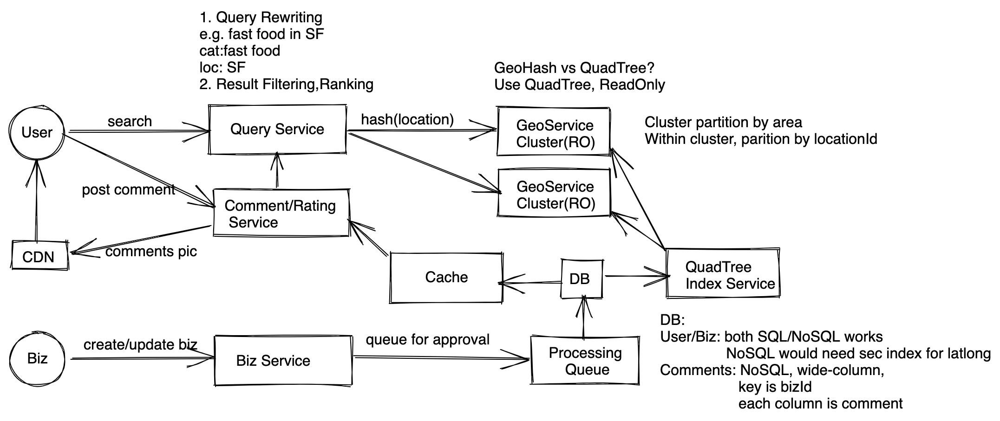

# 地理位置服务 - 设计 Yelp, POI, 附近的人...

## 题目
设计Yelp，可以查找附近的餐厅。

## 需求分析 
### 直接需求
* 用户可以增删改查地点
* 用户可以查找地点附近的服务
* 用户可以限定半径范围（附近10km）
* 用户可以对某个地点（餐厅）给出评价，包含评分，图片，文字等等。

### 隐含需求
* 读多写少
* 延时需要小
* 高可用性
* 一致性要求不高，最终一直即可。


## 估算 （Estimation）
* DAU: 500M, avg each user search once
* Read QPS: 500M / 86400 ~ 500M/100k ~ 5k<br>
* Write QPS: 假设为读的10%， 500 QPS <br>
* Data storage: assuming 1B locations, each location has 1KB metadata, we need 1TB for metadata
* Assuming each locationation has 10 comments, earch comments 1KB, we need 10TB in total. 

## 服务设计 (Service Design)
服务架构很简单，基本上就是一个搜索服务外加一个地理位置服务外加一些缓存。



### 搜索服务
接受用户搜索请求，用户会提供一些基本信息，例如{location, radius, pagination, category}，搜索服务根据这些基本信息把请求发送到地理位置服务去请求结果，然后最后汇总信息，过滤、排序结果。

### 地理位置服务
这个服务是设计重点，在设计之前，我们需要先讨论怎么存储地理位置。
#### 选项一：QuadTree
树的每一个叶子节点代表一个地里位置，存有一个locationid集合，我们可以给出一个限定范围，比如每个叶子节点最多可以有100个locationid，如果超过100个，我们就继续细分，我们不应该让每个叶子节点只存一个locationid，因为太浪费空间来。每个叶子节点可以是一个双向链表，指向前一个叶子节点和后一个叶子节点，同时有个指针指向父节点，这样可以很方便地找出该节点附近的其他节点。

`查找节点`：从跟节点开始，根据用户经纬度，不断找子节点， 直到叶子节点为止。找到叶子节点之后，就找到了用户对应的位置，这时候再根据用户请求参数（查找半径，查找分类等等）找到这个叶子节点附近的其他符合要求的叶子节点，一起返回给搜索服务。搜索服务根据这些id去获取其他信息做进一步的过滤排序等等操作。查找时间复杂度logn。

`存储空间`：假设locationid有64bit，一共8bytes，外加三个指针一共32bytes，我们有1b个节点，就需要32GB空间。这里空间不大，可以轻松放在一个服务器的内存里面。

`分区`：万一树需要很多空间，一台机器装不下，或者是读请求过多，一台机器服务不了，我们就需要分区，分区有两个选项；
一是按照地里位置来分，我们按照城市来做分区，某个城市的所有位置都分在一起，这样的好处是，坏处是流量分布不均匀，某些城市会成为热点，数据更多。
二是按照locationid来分，每个分区都有一个完整的quadtree，好处是分布均匀不会产生热点，坏处是每个查询请求都需要查询所有的分区才能得到最终结果。

因为我们这里树只需要32g，扩容完全可以选择整个树都复制到其他机器上，所以我们可以选择就不做任何分区，如果非要优化这个32G的空间，我们可以选择按照地里位置来分。传统来说按照locationid来分是比较通用的，但是这里我们还是选择按照地里位置分。其中两个原因。
1. 从qps角度来说，假设某个地方突然有大量qps，如果按照locationid来分，大量qps会被fan-out到所有分区，所有分区都要扩容，对于冷门分区不划算。
2. 从数据分布来说，我们系统几乎是只读的（商家信息很少变动），不会很快造成数据分布不均，所以不是很大问题，可能几个月甚至半年调整一次就好，而且都在内存里面，重新分区很快。

所以我们其实做的是一个混合模式，首先把所有机器根据地里位置分为小的集群，每个集群配置不一样，热门的位置机器更多，小的集群内部可以按照locationid来分。

`优点`：跟GeoHash比起来，不会出现距离很近的地点hash完全不同的情况，查找容易。

`缺点`：写频繁的时候需要不断合并，分裂节点，造成效率很低。

#### 选项二：GeoHash

`存储`：我们使用一个key-value存储即可
```
key: geoHash
value: Set<location1, locaiton2 ....>
```
key就是每个地点的geoHash,比如1a2b3c（6位的geohash精度为0.6km），然后value存这个地点对应的所有locationid。这里使用Redis是一个比较好的选择，redis直接支持存set，容易支持大量读操作，并且可以持久化。这里需要的存储空间为 8bytes location id * 1B + total geo hash count(固定数字，可以忽略) ~ 8GB。

`优化`：为了快速满足用户的查询需求（比如设置半径5km)，我们同时还可以把数据存，多份，比如`1a2b3c`这个位置的数据，可以同时存在`1a2b3`,`1a2b`,里面，这样存储空间需要增加2倍，变成24GB，依然不是很大。

`分区`：geohash本身就是哈希，所以最自然的分区方式就是按照hash来分区。但是这样分区会导致某些key成为热点，为此，我们需要在分区的基础上再做备份，对于热门地点，我们多做几个备份，比如`1a2b3c`变成`1a2b3c-1`，`1a2b3c-2`，`1a2b3c-3`，所有的请求随机分配到1,2,3即可。当然，同样还是能根据locationid进行分区，这样

`优点`：查找时间复杂度O(1)，直接通过hashkey就可以找到用户所在位置。

`缺点`：当一个地点在两个grid之间的时候，有可能附近的位置的geohash和当前grid的geohash不同，导致漏掉，这时候需要同时查找附近的几个grid才能解决。

#### 选择
无论是GeoHash还是QuadTree都是合理的，只要理解优缺点可以自圆其说即可。这里我们可以选择Quadtree，因为我们的系统不是写频繁的，QuadTree可以避免一些GeoHash带来的曲线

### 写服务
写服务比较点单，最后数据库选择可以是nosql，按照locationid来分区。

## 其他
#### 如果需要查询某个城市/某个商场里面的餐厅呢？
通过GeoFence把范围限定好，然后就在这些范围里面查询即可。


