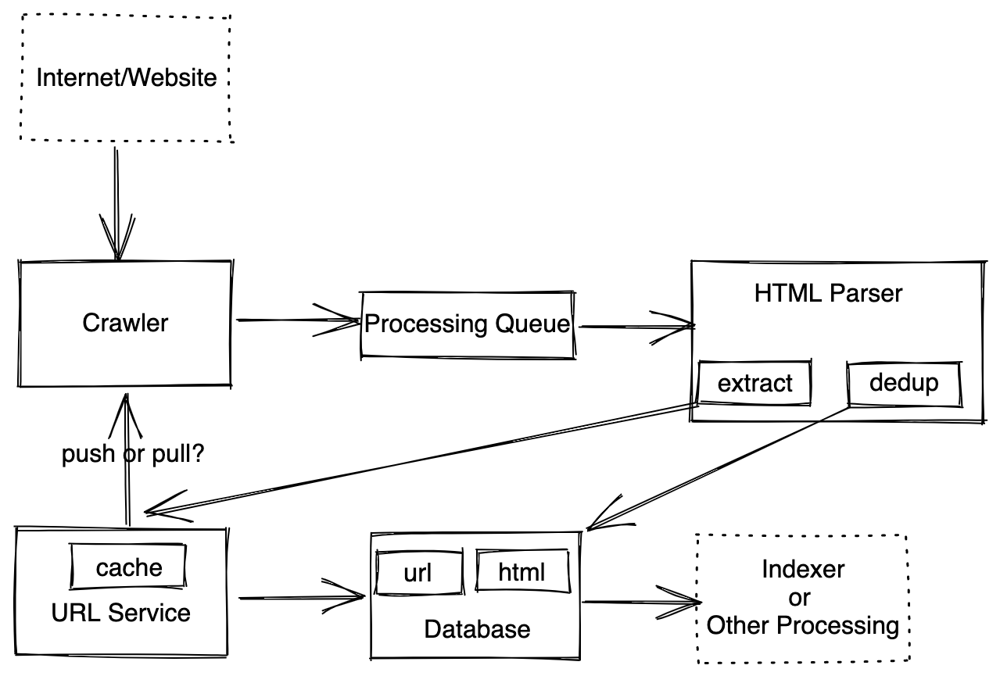
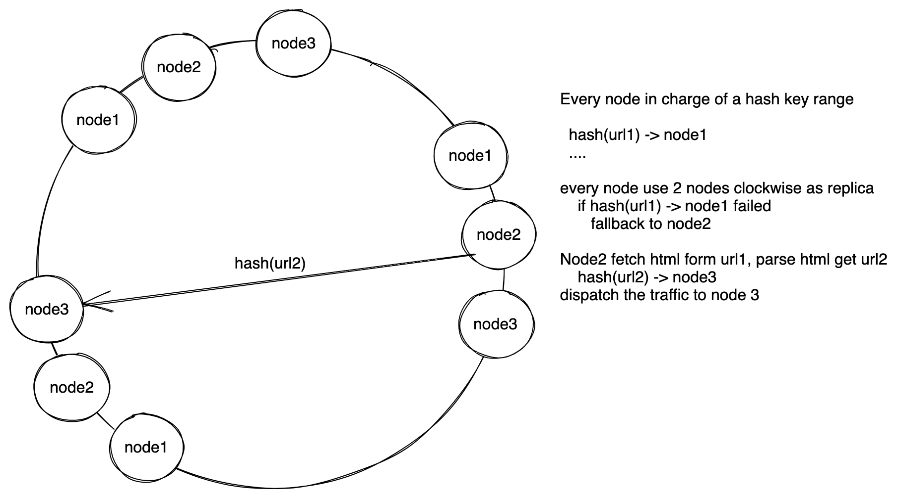

# 设计爬虫/黑客爬虫 - Crawler & Botnet Crawler


## 普通爬虫服务设计 (Service Design)
设计网络爬虫，抓取网页，然后根据网页内的链接继续抓取链接到的网页。

### 需求分析 
#### 直接需求
* 有许多服务器，需要去爬整个互联网
* 需要去重，不要反复重复抓取同一个网页
* 每个月要重新爬一次所有网站 
* （进阶）防止掉入爬虫陷阱

#### 隐含需求
因为没有在线服务，不是直接面对用户，对读和写的要求都可以放宽，也不需要很强的一致性，所以需求基本是系统设计普遍要求的：
* 可用性高
* 最终一致性

### 估算 
* 1 Billion URL，假设每个url里面还能链接到10个url， 一共10B URL
* 假设每个网页大小100KB，一共有10B * 100KB ~ 10^12 KB ~ 1PB
* 一个月需要爬所有网站，每天需要爬 10B/30days ~ 333M /day ~ 4K QPS

数据量大，QPS比较高，需要多台机器处理。

### 服务设计/数据流
爬虫的基本流程
```
1. 从一个url数据库里面读还没被爬的url
2. 访问那个url，下载html页面
3. 分析html页面，找到新的url
4. 把新的url加到1的数据库里，重复1
5. html做其他处理，比如建立索引之类的
```
爬虫算法应该优先使用宽度优先搜索(bfs)，这样可以防止在某个网站内一直爬浪费资源。


#### 爬虫服务(crawler)
核心爬虫服务功能很简单，读取还没有被爬过的url，访问url下载html内容。为了能更快爬更多内容，爬虫服务应该越简单越好，不应该有处理逻辑，这样我们可以用便宜的机器大量scale up。 爬虫服务爬完一个网页之后就把网页发到处理队列，让处理队列异步发送给html分析服务。发送的内容就是 url + html页面。
那么爬虫服务怎么获取url，是爬虫服务找url服务要url，还是url服务给爬虫服务发送url？
`爬虫服务pull url`：好处是爬虫服务可以根据自己的状况去抓需要的信息，不会造成负载过大。坏处是url服务不知道爬虫服务是不是
`url服务push url`： 好处是url服务可以安排机器，比如相同域名的网页分配到同一个机器上，这样可以减少建立连接的开销，也可以避免多台机器同时爬一个网站里面不同内容的情况（被网站判断成abuse）。如果爬虫服务宕机，url服务收不到响应，可以另外分配机器。
这里我们可选择push模式。

#### 处理队列(processing queue)
处理队列给html分析服务分配任务，这里可以选用queue-based的消息队列，比如ActiveMQ, RabbitMQ。

#### html分析服务(html parser)
html分析服务是处理队列的消费者，当其收到一个url和网页的的时候。分析服务首先判断这个网页是否已经被爬过。
`checksum`：可以对收到的网页计算checksum，然后去网页数据库里找是否有相同的checksum。当然，这样也导致我们需要建立一个checksum的索引，这样才能方便我们找到checksum是否存在，如果一个checksum有8 bytes，我们需要，80GB内存。这个方法好处是精度高，坏处是消耗一些内存。
`bloom filter`：parser也可以维护一个bloom filter，通过bloom filter来判断，好处是节省空间，坏处是可能会有精度问题，误判网页是否被抓取。
这里我们选择checksum，因为80G内存不是特别大，我们可以用空间换精度。

判断完是否需要分析之后，分析服务可以开始分析网页，把网页中的url都提取出来，这些url都是潜在需要继续爬的对象，将这些url发送给url服务。

#### url服务
url服务是核心服务，它维持一个待抓取url的的队列。当它收到html分析服务发来的url的时候，首先先做出分析，判断url是否近期被爬过，这个可以直接和数据库里面的时间戳做对比。为了提高效率，我们同样可以把url相关信息放在缓存里面。
```
urlcache {
    string url;
    enum: status;
    long lastVistedTimestamp;
    long nextExecutionTime;
}
```
假设一条信息50Byte，10b个网页需要500G的内存空间，需要在多台机器上。然后url服务可以把收到的url进行排序，分组等操作，更合理地分配给爬虫服务

#### 数据库
有一个URL数据库，存url相关的元数据，比如上一次被访问的时间等等。html数据库存网页blob。所有的数据都可以根据url来分区，因为这里读和写的过程都可以有我们自己控制，并不存在一个hot partition的问题。

### 其他
##### 如果网站不能访问了怎么办？
采用exponential back-off策略。爬失败了以后把url重新放回url服务的内存中，并设置好下次爬的时间。

##### 怎么防止爬虫陷阱，在一个网站内爬出不来？
给每个网站设置一个quota，超过quota就停止。quota需要另外维护一个缓存，key是域名，value是数字。

##### DNS Resolver
我们可以自己建立一个dns解析服务，让爬虫服务跟自己的dns解析服务通信，加快解析速度。

***
## 黑客爬虫服务设计
给你10K个机器，然后1B的url，机器之间尽量减少通信，问你怎么样每个机器才能平均的分任务
### 需求分析 
 * 没有重复的url 
 * 10k个机器要均衡分布
这个问题的核心其实就是基于一致性哈希的分布式哈希表。

### 服务设计/数据流
#### 选项一：leader-follower架构
`single leader架构`： single-leader就是类似经典的master-slave架构，有一台机器负责分配调度任务，安排剩下的机器去爬网站。好处是一台机器有强一致性，可以轻松判断url是否有重复，去重，坏处也很明显，会成为single-point-of-failure，而且题目要求机器之间尽量少通信，所以这个方法不行。
`multi-leader架构`：和single leader类似，只是把任务分给了多个leader，比如某个leader负责爬某个，然后这个leader再把，这样能减少一部分单点失败的压力。但是本质并没有改变，还是需要机器调度分配任务，还是会有不少机器之间通信，而且一旦一个leader被曝光之后，它管理的所有follower都会一并曝光。
综上我们不能选择有leader的架构。

#### 选项二：去中心化leaderless架构
纯分布式的架构，每台机器都是一样的拷贝，互相之间独立运行，这样机器之间通信可以分散开，不容易找到一个规律。即使一台机器故障，也不会影响到其他机器。以下我们会根据纯分布式的架构展开讨论，

### 去中心化架构
我们采用一致性哈希的思路，假设有一个大圆环，我们把10k台机器分别散布在圆环上，每台机器管理一个范围的hashkey。


具体流程如下
1. 把种子url和配置文件发给10k台机器，配置文件包含每台机器管理的hashkey的范围
2. 机器收到url，开始访问url抓取html信息，机器从html中提取其他url
3. 机器对提取的url做哈希，算出hashkey，在配置文件中找hashkey对应的机器
4. 把url发送给hashkey对应的机器处理

这样设计完全抛开了leader，每个节点都可以独立运行，通过一致性哈希能让url分布比较均匀，理想情况下每个url都到特定的节点，不会有重复爬的情况。 当然这是理想情况，我们还要考虑下面一些实际问题。


#### 丢失节点（机器）
当一个节点不响应的时候，需要我们顺着圆环顺时针方向找到hashkey对应的下一个节点然后向下一个节点重新发送请求。所以我们可以规定，每个节点顺时针方向后面的两个节点作为备份节点。如果一个节点没有响应，那么url发送方就去找顺时针方向的下一个节点处理。每当一个节点接受到url之后，会告诉备份节点，每个备份节点会存url是否被爬过，但是不会去爬。在下文我们会讨论一致性的要求。


#### 新增节点（机器）
新增节点也是，我们就把新节点插入两个原有的节点之间即可，然后根据插入为止调整haskey对应的节点范围。这里我们还需要向其他所有的节点都发送消息，让其他节点也直到新节点的存在，更新他们内部的hashkey->node对照表。这个新节点两边的原有节点还要把已有的数据（爬过哪些网站）发送给新的节点，这样保证去重。

#### 备份
和上面的丢失节点类似，选择顺时针方向的两个节点作为备份。

#### 去重
`单机去重复`：每台机器维持一个set，我们有10k机器，10b url，一台机器只要在内存维持 10^6个URL, 假设一个url大小为100Bytes, 只需要100MB即可，内存完全放得下，所以这里不需要用bloom filter来过滤。
`（非必需）整体去重`：还有一个要求是机器之间请求尽量少，所以我们如果能提前直到某个url已经被其他机器爬过里，甚至可以不用往那个机器发。如果我们再维护一个set，存所有的url是否被爬过，需要1TB空间，所以此时我们可以使用bloom filter，当确认某个url被爬过之后，可以加到bloom filter里面，这样下次可以直接判断，不用再发到其他机器。当然，bloom fitler会有一定错误率，这是需要考虑的。

### 一致性
我们还需要和面试官讨论一致性的需求，每个url是需要刚好爬一次，还是最多一次，还是最少一次，我们可以分开讨论。
#### 最多一次
最多一次几乎是最容易实现的，因为允许失败，如果某个节点失效了，我们也不用做任何操作。所以一个一台机器把url分配到另外一台机器上的时候，不用管成功失败。缺点是可能造成有的网址没有被爬。

#### 至少一次
至少一次也相对容易实现，如果一台机器把url分配到另外一台机器的过程中出现问题，没有收到那台机器的ack，那么就找url对应的备份机器再发一遍，直到成功为止。缺点是有的url可能会被爬多次，比如a把 `apple.com` 分给机器b，机器b收到了请求，但是回复给a的ack丢失了，a认为b没有收到，就会再给b的备份c发一次，导致b和c都去爬 `apple.com`。 不过优点是我们能保证所有的网站一定都能被爬到。

#### 刚好一次
刚好一次是最难的，因为需要事务，保证强一致性。保证刚好一次有两个方法，一个是选出一个leader来，但是这样又变回leader-follower架构了。我们可以选择另外一个方法：实现分布式事务。实现方式可以参考Paxos算法。这里我们需要把上面提到的架构稍微修改以下，我们把10k台机器分成数千个consumer group，这时候一致性哈希就不是到某一台机器，而是到某一个小组。然后每个小组里面有若干台机器，每个小组负责一个范围内的hashkey。当小组里面的机器收到url的时候，可以爬完之后可以向小组内其他的机器发起commit请求。这里和mult-leader架构还是有一些区别，就是小组内任何机器都可以发起commit请求，multi-leader架构里只有leader机器可以发起。


### 其他
#### 如果某些机器压力特别大，另外一些机器闲置怎么办？
我们采用一致性哈希的虚拟节点方案，一台机器对应多个虚拟节点，均匀分布在圆环上，这样我们能尽量避免这种情况发生。

#### 节点之间通信
节点之间可以批量发送数据，不用找到一个url就马上发送，节省通讯数量。

### 参考文章
http://boston.lti.cs.cmu.edu/callan/Workshops/dir03/PapersPublished/singh.pdf