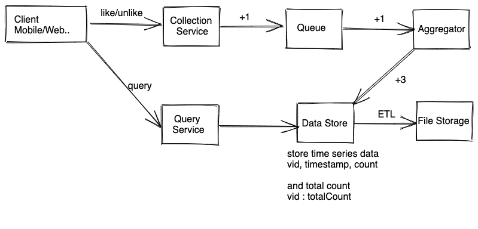
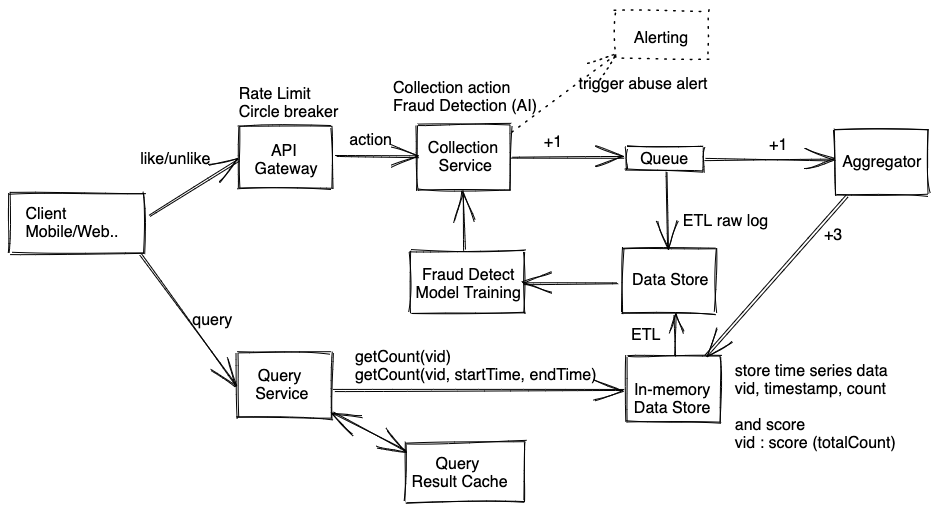

# 点击统计问题 - Click/Like Count

## 题目

这类型的题目大多都是设计统计某个内容（视频，广告等）的点击/点赞/收藏等数量。相关题目有：
* 设计显示每款游戏的点赞数 ，API，cache怎么设计之类的
* 计Game页面的Like/Unlike count这个feature，
* 设计一个rating system 比如油管视频类似的赞和踩

## 需求分析 
### 直接需求
这里我们假设点赞对象是视频。
* 用户可以点赞，踩某个视频
* 需要统计赞，踩的数量
* 用户可以看到每个游戏赞，踩的数量
* （进阶）需要防止恶意踩或者刷好评
* （进阶）需要根据统计数据算一个分数，基于此给用户推荐
* （进阶）需要看每个时间段（每小时，每x分钟）的统计数据，类似股票图
* （进阶）需要考虑赞，踩的时间（recency）


### 隐含需求
以下内容需要跟面试官确认。
* 读频繁 (write heavy)
* 数据不要求有非常高的实时性（可以有适当延迟）
* 数据不要求有非常高的精确性（这一点可以跟面试官讨论， 有时候需要完全精确）
* 高可用性（一般系统都需要）
* 数据存储一致性 Consistency: 最终一致即可 Eventual consistency，CAP中更侧重A,P


## 估算 （Estimation）
* DAU: 1 Billion, 20% of user like/unlik everyday <br>
* Write QPS: 1B * 20% / 86400 ~ 200M/100K ~ 2k QPS, peak QPS ~ 6k<br>
* Read QPS: assume people see 20 videos summary a day, read QPS ~ 200k  <br>

数据量虽然不大，但是读QPS比较高，需要多台机器处理。

## 服务设计 (Service Design)
搜集赞/踩数据系统很简单，基本上就是写服务，查询服务，消息队列外加一个存储。大致如下图所示



### Trade-off
在谈具体服务之前，我们先简单介绍一下这个设计我们做了哪些权衡。

#### 流处理 Stream Processing vs 批量处理Batch Processing
考虑到统计点赞/踩数据并不是核心业务，一般这些只是视频显示页面一个很小的部分，我们不应该投入太多资源去建立一套Lambda架构，所以我们应该在流处理和批处理之间做出选择。具体优缺点分析可以参考 [流处理 （Stream Processing）和批量处理（Batch Processing）](../SystemDesignBasics/stream-batch.md)。

同时对于数据也不需要十分精确，时效性对本系统来说更重要，所以我们选择流处理方案。

### 数据搜集（Data Collection）服务
API设计大致如下：
```
count(userId, entityId, actionType)
e.g.
count(user_1000, video_2000, LIKE), 
count(user_1000, video_3000, UNLIKE), 

客户端不应该发时间戳，时间戳应该在服务器端加上。

如果要进一步扩展，可以带上tracking，譬如browserId, likeAfterSeconds, 
```
搜集服务把收到的信息发送到消息队列做进一步处理。到目前为止，搜集服务并没有什么复杂的逻辑，它更像是一个stateless的API Gateway。但是我们还需要考虑进一步的需求，比如我们要检测恶意刷好评，差评，那么搜集服务就会增加检测恶意用户的功能，把恶意用户都过滤掉。具体我们会在下文做更详细的介绍。


### 消息队列 
既然选择了流处理，常见的流处理架构都会带上消息队列，这样可以实现弹性处理，同时做流量削峰。但是我们看看本题的需求分析，我们估算显示写QPS只有大概6k，一般的机器都能处理这么小的QPS，从QPS的角度来说，消息队列其实就不是非常必要了。但是我们依然选择使用了消息队列，主要基于几个考虑：
* 服务的可扩展性：这一套架构除了搜集点赞/踩以外，完全可以应用到到其他用例上，比如统计收藏数量，统计点击数量，统计观看数量等等，扩展以后流量变大，消息队列的优点就更加明显了。
* 容错，备份：消息队列通常自带分区，备份等功能，当出现问题的时候，可以很容易恢复，提高系统的可用性。

这里建议使用log-based 的消息队列，譬如kafka，这样我们同时可以在硬盘存一份原始数据，记录哪个用户在哪个时间段给给哪个视频做了哪个操作。

### 数据聚合（Data Aggregation）
数据聚合服务就是消息队列的消费者，将消息队列中的消息读出，然后更新存储中的统计数据。作为优化，聚合服务不需要每次处理一个消息就往数据库里写一次，可以适当缓存一定统计数量，然后再往数据库写一次，比如每隔3-5秒写一次，或者把同一秒内对不同用户对同一个视频的点击都，这样把多个 {+1,+1,+1} 请求变成一个 {+3} 请求往数据库里写。

当然这样操作也是有缺点的，就是如果统计出错，因为某些原因把+3统计成了+4，这样修正就比较麻烦，需要重新消费消息队列里的log。考虑到题目里面要求精度不是很高，偶尔错误是可以接受的，所以我们可以做这样的优化。


### 存储(Data Storage) 服务
我们在需求分析中找到了两个和存储有关的需求。
* 用户可以看到每个游戏赞，踩的数量
* （进阶）需要看每个时间段（每小时，每x分钟）的统计数据，类似股票图

#### 方案一：内存数据库
这里因为写请求不是很多，其实SQL也行，NoSQL也行，考虑到系统需要高可用性，降低延时，最终一致性，我们可以选择使用内存键值数据库（比如redis）。大致需要数据结构。
第一个是简单的哈希表：
```
key: videoId, value: totalCount
```
第二个是时间序列（time series）
```
key: videoId, timestamp: {startTime, endTime}, value: count during timestamp
```
以上功能Redis都能实现，redis有自带counter功能可以很好支持total count，同时也支持时间序列。当然，也可以自己写一套管理系统，并不是十分复杂。 

#### 方案二：NoSQL 
NoSQL在数据持久化方面还是比内存数据库更优秀。如果整个系统只是需要知道一个总点赞数，不需要颗粒度更细的数据，我们使用内存数据库即可。如果我们需要支持大量的时间序列查询，那么我们NoSQL是一个比较好的选择。这里可以选择Wide-column NoSQL，column是时间戳，这样可以很好实现排序和范围查询。

### 数据查询（Query）
API 大致如下
```
getCount(videoId, action)
getCount(videoId, action, startTime, endTime)
```
查询服务业务逻辑也相对简单，将请求转化为数据库查询语句即可。作为优化，查询服务可以缓存一部分查询结果，这样对热门查询，可以直接返回。

## 服务扩容 （Scale Up)



### API Gateway
考虑到我们进阶需求， 其中有一条是需要防止恶意踩或者刷好评，我们可以在搜集服务前加一个API Gateway。Gateway可以部署针对用户（userid）的Rate Limiter, 这样就能限制一个用户的操作数量。同时，网关还能作为一个circuit breaker，当服务出现大量错误的时候，可以控制流量，防止大量重试请求进一步加重服务器负担。

### 消息队列和消费者
消息队列常见的扩容方式就是增加分片（partition），同时在不同的分片存有备份（replica），这样可以防止单点故障。同时消费者也有多台机器，分别消费不同分片的消息，这样消费者（数据搜集服务）也实现了扩容，其实他们是一体的。这里我们可以使用videoId作为分区键（partition key），这样可以让一个视频的统计数据都聚合到一个，一般来说kafka的吞吐量极大，即使一个视频十分热门，也不容易出现hot partition的问题，当然，如果一定要追求更平均的分配，按照用户id来分区也是可以的，因为我们对用户有rate limiter，用户不会造成hot partition。

### 恶意用户检测和报警
前面我们选择了Log-based消息队列，有一个原因就是因为能保存原始数据，每一个用户的操作都会被加到log里面。log可以隔一段时间就ETL到比较便宜的文件存储里面去。需要的时候可以在加载出来，标注以后作为训练集给训练Fraud Detection 模型。模型训练好了之后加载到数据搜集服务里面，搜集服务就可以判断每个用户操作是否是恶意操作，如果不是，则放入消息队列；如果是，则发送到监视系统，监视系统根据情况（譬如突然增多网络攻击）触发警报（alerting）。 

### 数据存储
存储统计数量的时候，我们本身就选择了内存数据库，扩容方式就是经典的分布式缓存，具体可以参照 [缓存 Cache](../SystemDesignBasics/cache.md) 一文。另外上文还提到，我们可以选择使用NoSQL来存时间序列数据，数据库可以使用videoId作为分区，这样查询一个视频的统计数据可以直接在一台机器上获得，一致性哈希可以保证数据库分配尽量均衡。


## 其他
#### 如何检测恶意用户？
大致一下几个思路：
* 检查用户的观看时间和点赞/踩数量，如果一个用户每次都是看一秒钟就点，很有可能是恶意用户
* 检查用户的在线时间和点赞/踩数量
* 检查用户是否有某种规律（bot）
...
为了防止恶意用户，我们可以在客户端加上CAPTCHA等验证方式。


