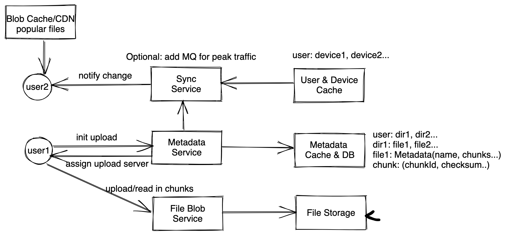

# 分布式文件系统 - Design Dropbox/Google Drive..

## 题目
设计分布式文件系统，例如dropbox, Google Drive..

## 需求分析 
### 直接需求
* 用户可以上传文件
* 用户可以对文件做增删改查操作
* 用户不同设备之间可以同步文件
* 用户和用户之间可以同步/分享文件/文件夹

### 隐含需求
以下内容需要跟面试官确认。
* 高可靠性，用户同步的内容不能丢失
* 不需要强一致性，但也不能有太多延迟
* 高可用性（一般系统都需要）
* 尽量节省空间

## 估算 
* DAU: 100M
* Write QPS: 假设每个用户每天上传一个新文件，100M / 86400 ~ 100M / 100k ~ 1K QPS。
* Read QPS: write * 10 ~ 10K QPS <br>
* Data storage: 假设一个文件1MB, 100M * 1MB * 365 * 5 ~ 200 PB

数据量大，服务用户多，肯定需要分布式系统来处理。

## 服务设计/数据流



### 元数据服务(metadata service)
元数据服务是系统的大脑，当用户发起上传的时候，大致流程如下
1. 客户端拆分文件成不同chunk
2. 元数据服务检查用户权限
3. 元数据服务检查哪些chunk需要被跟新（如果新文件，就都需要更新，否则部分更新）
4. 元数据服务允许上传，返回token/signedURL，让客户端上传，token有过期时间。
5. 客户端联系上传服务上传
6. 上传完成客户端联系元数据服务通知完成
7. 元数据服务可以做后续处理（比如通知同步服务等）

#### 元数据格式
```
Metadata {
    name, namespace, createdAt, lastupdated, version, size... // file related data
    owner, accessLevel.... // visibility related data
    List<Chunk>; // reference to chunks
}
Chunk: { chunkid, checksum...}
```
#### 元数据存储
元数据服务可以考虑使用SQL存储，这样自带ACID特性，也可以考虑NoSQL + 用分布式锁来保证数据一致性。我们选择后者，方便处理大量写请求。

#### 文件更新
如果用户只是对文件的某一部分做出更新，有可能大部分chunk都没有变化，这时候只需要让用户上传变更部分即可，节省带宽，避免反复存储。

### 客户端
客户端向元数据服务发起上传请求后，元数据服务返回上传服务的信息，客户端向上传服务传文件，考虑到移动端断点续传的需求，客户端需要把文件拆分为大小不同的chunk，然后按照chunk来上传，每个chunk会带一个校验码checksum，一般来说64MB大小的chunk只需要64B的checksum。 Chunk的大小可以根据实际情况来判定，如果都是大视频文件，可以用大的chunk，如果多是文本文件，可以用比较小的chunk（比如4mb），但是也不能太小，否者导致有很多overhead。


### 文件服务(File blob service)
客户端从元数据获得上传url之后，就可以向文件服务上传，如果文件服务发现一个chunk的checksum不正确，则向客户端要求重新传输。上传有两个选择。
`客户端分别向多个服务器上传`：客户端分别向不同的服务器上传不同的chunk。好处是减少服务器之间通信，坏处是客户端逻辑复杂，不容易更新。
`客户端向一个服务器上传`：客户端向一个服务器上传，这个服务器再把不同的chunk分发到其他上传的服务器上。
这里我们选择后者，简化客户端逻辑。文件服务之后把文件放入文件存储中去。
#### 文件存储
文件存储服务就是一个简单的文件系统，可以直接根据chunkid进行分区，类似一致性哈希。

### 同步服务
这一部分和实时聊天系统类似，当client在线的时候，客户端和同步服务通过long-polling或者socket保持连接，这里我们可以选择long-polling，因为大部分时候我们不需要频繁双向通信。
`客户端在线的时候`：当客户端有变化的时候，客户端向元数据服务发送请求更新。当其他客户端有变化的时候，元数据服务会将变化发送给同步服务，同步服务找到客户端。
`客户端离线的时候`：一上线直接向元数据服务发起pull请求，附上上一次同步的时间（或者版本号，版本号更好，这样不会有时间同步问题），元数据服务根据lastupdated返回之后更新的元数据，客户端到

## Scale up
#### 文件如何备份
文件分成多个chunk，每个chunk都有多份拷贝分别复制到多台机器上，通过checksum来判断拷贝是否正确。如果一台机器上的chunk有问题，该机器应当通知元数据服务，元数据服务查找其他拷贝的机器，通知机器去其他机器复制。

#### 冲突处理
如果客户端在离线的时候修改了一个文件，同时另一个客户端也修改了同样的文件，怎么处理？
`Last Write Win`：好处是简单，坏处是很难做到智能处理，很难判断谁是last write。
`留给用户处理`：如果发生冲突，候我们应该让他们变成两份文件，然后分别同步给对方，让用户来判定如何处理冲突。


## 其他
#### 在Internet受限的地方，要如何改进service
客户端根据网络状况判定是否要下载同步的文件，还是只下载元数据。


