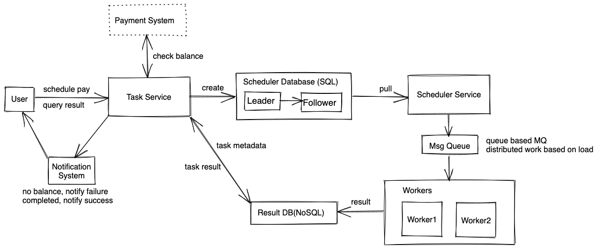
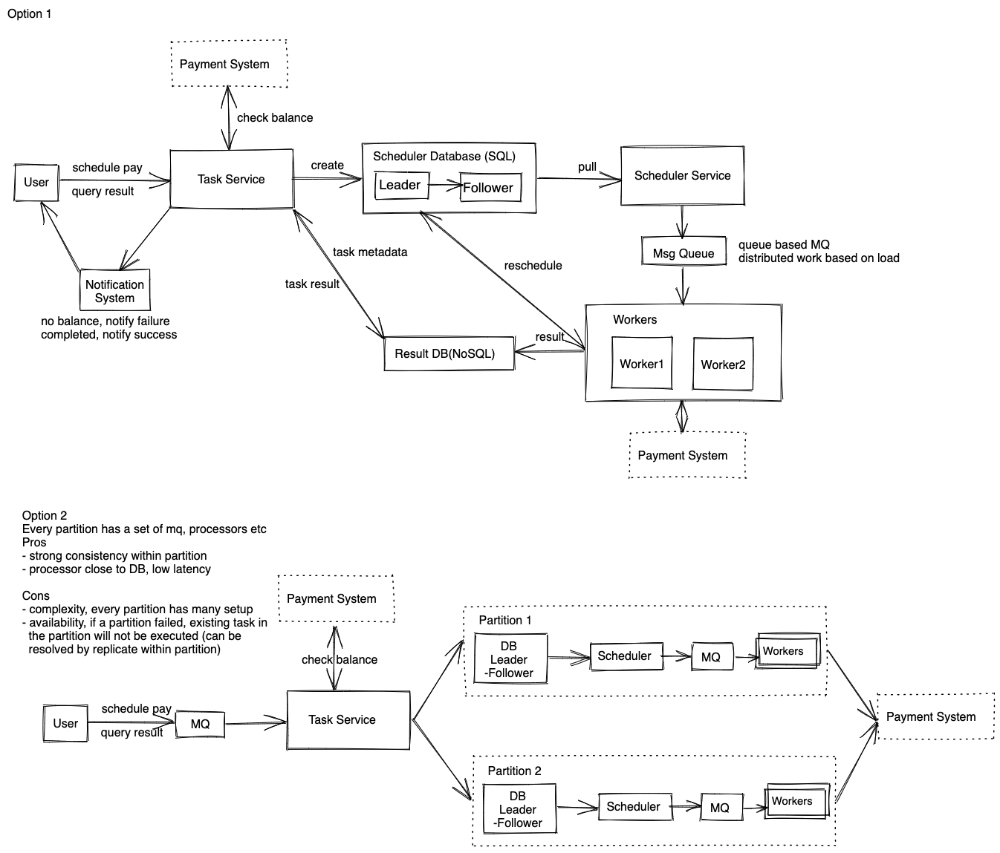

# 分式工作调度系统 Distributed Event/Job Scheduler

如果是在单机上，实现任务调度通常有多种实现办法，其中一个比较经典的算法就是时间轮，具体可以参照[一张图理解Kafka时间轮(TimingWheel)](https://juejin.cn/post/6844904110399946766)。这里我们只讨论分布式调度系统的设计。

## 题目
设计一个作业调度系统，一般需要支持延迟执行，比如：
* 实现一个延迟转钱的API， 比如说A 三天后转200刀给B
* 设计一个类似amazon 的功能， 商品卖出去后可以钱延迟release给商家
* 设计job scheduler，db怎么存，message queue，写consumer function， fault tolerant


## 需求分析 
这里我们以设计延迟转钱为例子。

### 直接需求
* 用户可以新增延迟转钱任务，设定任务执行时间和执行规律，比如：过10天后执行、每30天执行一次等等。
* 用户可以查询任务执行状态
* 用户可以修改、取消任务
* 每个任务至少要执行一次（需要和面试官确认至多一次，刚好一次，和至少一次）
* 任务执行可以稍微有几秒延迟，设定1天后执行，实际上1天零2秒执行也可以接受，这里可以规定P95 Latency 5s
* 安排转钱之前需要检查用户账户余额
* 接收方的可能会出现不可重试的错误，比如接收方账户被注销等
* 转账支付系统不在讨论范围之内

### 隐含需求
以下内容需要跟面试官确认。 
* 系统要保持高可用性
* 持久性（Durability），任务一旦被安排后不会丢失
* 任务在任何一台机器执行结果都应该一样，
* 至少执行一次要求任务是idempotent
* 查询任务状态可以是最终一致，设计任务执行的部分需要强一致性，以防多个机器同时执行任务

## 估算 
假设我们设计电商平台延迟转钱API
* DAU: 1 Billion <br>
* Write QPS: 假设20%用户一天有一笔成交，1B*0.2 / 86400 ~ 200M/100k ~ 2k QPS, peek 6k，极端峰值可能更高，比如黑五促销<br>
* Read QPS: 假设每个用户每天都会查询一次任务状态，1B / 86400 ~ 1B /100k ~ 10k QPS <br>
* Data storage: 200M post * 1KB per job = 200GB / day <br>

## 服务设计/数据流


### API
```
transfer(fromUserId, toUserId, amount, schedule)
```

### 数据存储
我们大致需要存储以下信息
```
User: id, name, email, balance
Task:  taskId, fromUserId, toUserId, amount, schedule, status

status: [SCHEDULED, ACQUIRED, RUNNING, ABORTED, FAILED, SUCCEED]
schedule: {tartTime, endTime, nextExecutionTime, recurrence}
```
为了保持数据的强一致性，我们把Task表放在SQL里面，数据库可以通过leader/follower架构进行备份，考虑到写qps不是很高，

### Task Service, Scheduler Service 和转账流程
1. 用户发起转账请求
2. 转账服务检查用户余额，如果余额不足，直接返回失败，如果余额充足，执行3
3. 从用户账户扣款，并创建Transaction记录，设置status=SCHEDULED，两个操作需要同时成功（DB Transaction），任意一个失败需要执行回滚
4. Scheduler Service 从数据库中取出待执行的任务（schedule.startTime <= currentTime)，然后更新任务的status=ACQUIRED 
5. Scheduler Service 将任务放入消息队列，消息队列分发给消费者
6. 消费者接受到任务，更新任务状态status=RUNNING
7. 消费者执行任务，
    7.a 失败，并且是不可恢复的失败，比如账号注销等，将任务更新为ABORTED失败，之后不会再被取出执行，然后把结果写入Result DB，并从Scheduler DB 删除
    7.b 失败，是可恢复的失败，将任务更新为失败，将任务状态更新为 FAILURE，然后重复第4步。
    7.c 成功，将任务更新为SUCCEED，写入Result DB, 并从Scheduler DB 删除

**如果第6步成功，消费者出现故障没有执行任务怎么办？**
给每个running 任务设定一个timeout，增加一个检测服务，如果检测到timeout过了状态还没有更新，重新设置为SCHEDULED状态

**如果执行任务成功，但是成功后worker故障，没有把SUCCEED写入数据库怎么办？**
大致有以下几个思路：
1. worker保持一份WAL，从日志中恢复。
2. worker执行任务时需要调用Payment System，我们让payment service也保持idempotent，这样我们可以继续依赖running任务的timout来重新安排任务，哪怕重新执行，因为idempotent的特性，不会影响结果。

**消息队列的作用**
作为缓冲进行削峰操作，在极端情况下，例如黑五促销，秒杀活动等，会导致突然有大量付款请求，我们首先可以在task service之前先增加一个message queue作为缓冲，这样可以缓解生产者端的压力，但是这样并不能防止很多用户安排同一时间付款，所以我们在消费者端，即scheduler service和worker之间也需要再增加一个消息队列。


## 其他

### 另外一种思路
把整个服务分成多个partition，每一个parition里面有一套的数据库，scheduler，消息队列和worker，我们在partition里面保证强一致性。任务由load balancer分配到每个partition，可以是round robin或者consistent hashing。大致如下图中的option 2。


## 参考资料
* https://dropbox.tech/infrastructure/asynchronous-task-scheduling-at-dropbox
* https://netflixtechblog.com/distributed-delay-queues-based-on-dynomite-6b31eca37fbc
* https://medium.com/airbnb-engineering/dynein-building-a-distributed-delayed-job-queueing-system-93ab10f05f99