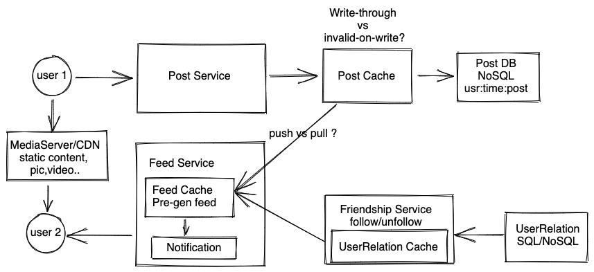

# 信息流 - Newsfeed/Timeline

## 题目
设计NewsFeed/Instagram/Twitter...等社交网络时间线相关问题，返回好友发的内容。

## 需求分析 
### 直接需求
* 用户可以发新的内容（feed）
* 用户可以看到好友发的内容，和用户关注的名人、活动、群等等发的内容
* 用户可以看自己发的内容（homepage）
* 内容有文字，图片，视频等
* 用户可以增加、删除好友
* （进阶）可以看到朋友的朋友(2nd degree connection)发的内容
* （进阶）需要有Privacy Setting，可以控制那些人能看，那些人不能看。

### 隐含需求
以下内容需要跟面试官确认。
* 读多写少
* 高可靠性，用户发送的内容不能丢了
* 不需要强一致性，但也不能有太多延迟
* 高可用性（一般系统都需要）

## 估算 
* DAU: 1 Billion <br>
* Write QPS: 假设20%用户发帖，1B*0.2 / 86400 ~ 200M/100k ~ 2k QPS, peek 6k<br>
* Read QPS: 1B / 86400 ~ 1B /100k ~ 10k QPS <br>
* Data storage: 200M post * 1KB per post = 200GB / day <br>

数据量大，服务用户多，肯定需要分布式系统来处理。

## 服务设计/数据流
整个系统可以分为三大核心服务，一部分是写服务，让用户发帖。另一部分是读服务，让用户读取好友发的内容，还有一个好友管理服务增减好友。除了核心服务之外，考虑到用户可以发多媒体内容，还需要一些存储服务，分发服务(CDN)。



### 写服务（Post Service)
当用户发送一个帖子的时候，将帖子存入帖子数据库。当有多媒体内容的时候，我们另外把该内容存在文件系统里。


### 好友服务(Friendship Service)
我们还需要有个好友服务，用户可以关注或者取消关注某人。当用户关注新人的时候，时间线上应该加入新人的内容，同理，取消关注之后，被取关的人的帖子不应该再出现。 好友服务的

##### 数据结构
好友关系存储很简单，一一对应即可，因为好友关系是双向的，所以我们存两条记录。
```		
  FromUser	ToEnitty	
  A 		B 	        	
  B 		A 	        	
```
当需要获取a的好友的时候，直接在表中找所有 `fromUser = A` 的记录即可。这里需要一个查询功能，而且用户也不会频繁写入好友，好友服务可以使用SQL存储，这样找a的好友可以轻松通过index找到。当然因为服务比较简单，用NoSQL也可以，key可以是用户id，value是朋友列表。


### 读服务（Feed Service）
用户还需要能查看别的朋友发的帖子，这时候就需要用到读服务，读服务有以下几个选项。

##### 选项一：Fanout-on-read （pull）
简单直接的方式就是用户去抓去好友列表，然后根据好友列表，再去帖子数据库读取每个好友发的最近的帖子，最后做一个排序返回给用户，这样做的时间复杂度很高，假设用户有n个好友，每个好友读m个帖子，最后排序，那么复杂度为 O(n) + O(nmlognm)。
读QPS: n (n = 好友数量)
写QPS: 1 
这样的问题是读操作很多，每一次用户的一个读取请求在后台会变成 n个请求分别去获取每个好友的帖子，并且n不是一个非常小的数据，一个读QPS变成数百个DB read QPS，这样会让数据库变成瓶颈，致延迟，因为读操作不能异步操作，所以延迟会影响用户体验。

##### 选项二：Fanout-on-write（push）
为每个用户建立一个类似于Inbox的列表，在内存中就是一个简单的`Map<UserId, List<Feed>>`，当一个用户帖之后，系统查找用户的好友，然后把用户发的帖子通过异步通信一一写到每个好友的Inbox里面。
读QPS: 1
写QPS: N (n = 粉丝数量)
这样的问题是写操作很多，即便使用异步通信，如果粉丝数量很大，依然会造成很大的延时，并且短时间会对系统造成巨大压力。

##### 选择
通常大家会选择混合模式，对于普通用户使用Fanout-on-write，对于粉丝多的用户使用Fan-out-on-read。当一个用户查看newsfeed的时候，从该用户的Inbox里读取普通好友发的帖子，同时去该用户关注的名人那里读取名人发的帖子，最后整合起来。但是这里我们选择选项一 Fanout-on-read，理由如下：
* 用户的好友有上限，大部分用户在几百个之间，可以找到优化方式，但是如果使用push，用户的粉丝数量可以太多，异步通信也是很大压力，优化起来不太现实。所以pull可以有更高实时性。
* scale up角度来说，读比写更容易scale up。
* 混合模式实施起来复杂，给系统增加复杂度。

选择Fanout-on-read之后，我们可以采用一些方式做优化，减少数据库压力。

###### 增加缓存

`缓存每个用户发的帖子`：我们使用给一个缓存存每个用户最近发的100条帖子，我们可以规定只存DAU的帖子，假设1B DAU，每个用户50条，每条帖子1KB（也可以只存每个帖子的id，然后再另外有一个缓存存放id对应的帖子），我们需要空间有 1B * 50 * 1KB = 50TB。一般高性能缓存能提供至少128G空间，需要大约400台机器，1B DAU的系统来说是可以接受的。缓存可以轻松承载百万级别QPS，前面我们计算了read qps = 10k，假设每个用户端的变成n个读请求，n = 200， 那么只有2M QPS。 我们可以使用write-through cache, 这样用户发新的帖子也会直接写入缓存，缓存中始终有最新的帖子。如果觉得占用缓存太多，为了减少空间，可以在写的时候invalid cache（并不是所有人发的帖子都会被好友读到），不把新的帖子写入缓存，等真正被读时候在写。
当一个用户的帖子不在缓存中，但是突然有大量用户想访问该用户的帖子，为了防止惊群效应（Thundering herd problem），可以只让一个请求去数据库中读数据，然后剩下请求到缓存中读取。虽然缓存能轻松承载百万级别qps，但是还是存在一部分超级用户成为hot key的情况，所以我们可以用下面的办法进一步减轻服务器压力。

`缓存每个用户的feed/预先生成Feed`： 我们还可以进一步缓存用户的feed，当用户上线第一次读取，我们会从用户帖子缓存中读用户N个好友的最新的k个帖子，然后排序之后返回前20个，那么剩下的帖子就可以放在缓存里面，当用一个用户刷新的时候，可以附上上次读取帖子的时间戳，这样我们可以在缓存中继续抓剩下的而不用去数据库重新读取。再进一步优化，我们还能根据用户习惯预先生成feed，这样用户一上线就能读到。当然这些优化的代价就是额外空间花销，我们需要额外50T ~ 100T的空间。如果在这期间好友发了新的帖子怎么办？如果用户在线，读服务可以定期检查用户好友是否有发新帖子，当然这样并不是一个很高效的方式，我们不好选择定期间隔时间。所以是否缓存用户的feed可以跟面试官讨论。


## Scale up
#### 帖子数据库怎么分区
前面提到用户发帖存在NoSQL，分区方式有两种。
##### 选项一：按照userid来分区
每个用户发的帖子放一起，好处是可以很容易拿到用户发的所有帖子，坏处是如果一个用户变成热门用户，会导致hot partition，而且用户的热门程度是会变化的，而且有的用户比其他用户发帖更多，也会导致数据不均衡，这样会导致一直要re-partition数据库。 
##### 选项三：按照postid来分区
好处是可以让数据均衡分布，如果把timestamp放到postid里面，还能根据timestamp过滤结果，坏处是如果要获取一个用户的帖子，需要访问所有的分区才能整理出来。

##### 选择
我们还是选择选项二，数据库re-partition工程量太大，不容易实现。针对选项二的缺点，我们可以增加一层缓存，也就是上面提到的`缓存每个用户发的帖子`。这样就不需要每次请求都把数据库所有的分区都读一遍。

#### 好友服务
因为写少读多，写方面直接选一两个leader即可，然后数据库可以有许多follower（replica）来支持读服务，并且可以再加一层cache让读变得更快。假设1B活跃用户，每个用户200个好友，每个用户uuid有8 bytes, 1B * 200 * 8Byte = 1.6TB。 

#### 把名人的数据分开
可以专门开一个集群，把粉丝比较多的名人的数据分发到那个集群上，那个集群可以优化。

## 其他
#### 怎么做notification
读服务预先生成用户的feed，当生成新的内容的时候，就给用户发推送。

#### 在Internet受限的地方，要如何改进service。
减少或者取消push notification，用低清晰度的图像，视频或者只包含文字。

#### 怎么处理hot data
`缓存每个用户的feed/预先生成Feed`就可以，这样可以避免所有用户同时读取同一个用户帖子的问题。如果某个用户（elon musk）的主页特别多人突然访问，还是会存在缓存也撑不住的情况，这时候可以备份多个，当一台主机无法支撑访问的时候，可以直接redirect到另外一台主机上。

#### 有隐私设置控制每个帖子可见范围（朋友的朋友，特定群，黑名单...）
这是一个很复杂的功能，可以单独作为一道面试题来讨论。这里主要讨论几个方面。
##### 用户帖子如何存储
`帖子加上一个privacy数据`：比如 {privacy: friend_of_friend}，这样
`帖子直接加上可见/不可见人的id`：比如 {allow: [id1, id2], deny:{id3}}，
我们选择混合模式，这样既可以满足自定义要求，也可以满足常用的分组需求。

##### 怎么根据隐私设置生成feed
`朋友可见`：这比较简单，直接读取朋友时间线即可。
`朋友的朋友可见` ：对于朋友的朋友可见，暴力解法是直接去读朋友的朋友列表，然后再读他们的帖子，这样的问题是复杂度变成O(n^2)，n是平均用户好友数量，n=100的时候，复杂度变成10k对系统压力很大。一个优化是我们直接去读服务找好友的feed，因为好友的feed已经包含了好友的好友发的帖子，然后过滤掉不可见的即可，这样就把复杂度降为O(n)。
`对于特定群组（group）可见`：由于不用的用户可能在一个群组里面，暴力解法就是去查找用户所在群组，然后把群里面所有用户的帖子都找出来，最后整合，这样效率很低。我们可以把一个群组当成是一个用户，每次用户往发帖的时候，我们把帖子push到群组的列表里，这样每个用户生成自己，只需要去读自己所在群组的时间线即可。

## 参考资料
* https://secure.trifork.com/dl/qcon-newyork-2012/slides/facebook%20news-feed%20qcon%202012.pdf