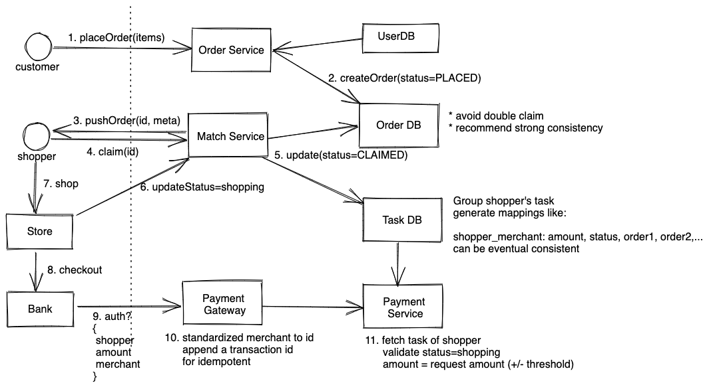
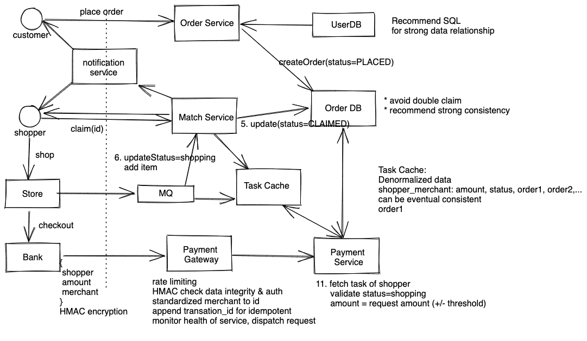

# Payment Verification Service - Instacart

这是一道Instacart的面试题。[具体可以参考这里](https://www.chegg.com/homework-help/questions-and-answers/system-design-instacart-shopper-payment-accept-reject-payment-service-shopper-instacart-cu-q61714886)

https://www.1point3acres.com/bbs/thread-777511-1-1.html

## 需求分析 
### 直接需求
设计一个支付授权服务，接受银行发来的请求，包含如下信息
```
{
	shopper_id: 123，
	amount: 300,
	merchant: {
		name: "Target",
		address: "123 Main St"
	}
}
```
需要根据信息判定是否授权支付，还是拒绝支付。这里需要注意一个问题，实际支付价格可能和系统中显示的价格不太一致，譬如买水果可能重量有一些区别。

### 隐含需求
* 高可用性，保证shopper能顺利完成支付
* 低延时，比如P99 Latency < 1s
* Durability，一旦状态改变不会丢失
* 系统核心譬如支付状态需要强一致性，防止重复支付，其他部分可以是最终一致
* Idempotent，同样是防止重复支付
* 安全，防止欺诈

## 估算
单从payment的角度来说，主要的请求来源于shopper购物，然后通过银行完成支付，假设我们有1M shopper同时在购物，平均购物时间一小时，那么支付系统 1M / 3600 ~ 2.5K QPS

shopper在购物的时候，要随时把已选购的商品更新成已获取，如果价格有出入，需要更新价格，所以购物过程中也有一定的写请求，同样假设1M shopper同时购物，每个人平均要选100个商品，平均购物时间是一小时，那么写QPS = 1M * 100 / 3600 ~ 100M/4K ~ 250k QPS

## 服务设计


### 数据存储
数据库大致需要以下几个表
```
# 用户表，存客户基本信息
Customer: id, name, email, etc

# 订单表，存用户和订单的信息
Order: id, customerId, merchantId, status(PLACED, SHOPPING, DELIVERING, COMPLETE), 

# Item表存每个订单里包含的物品，需要分开存系统价格和实际价格
Items: id, orderId, estAmount, actualAmount, unit, count, status

# Shopper表，存shopper基本信息
Shopper: id, name, email, etc

# 当然还有一些其他数据库表存商家信息，商家库存等等，并不是本题重点。
Store Table, Stock Table, etc
```

其实从数据结构来看，数据之间有强联系，如果我们使用NoSQL，需要denormalize一些关系，譬如订单->商品，用户->订单等等，这样会导致写的时候比较麻烦。同时考虑到我们写QPS在250k qps，虽然数字不小，但是写的请求是分散到每个订单每个商品之上的，并不是存在对同一个资源大量写入的情况，同时部分系统数据，譬如订单状态，需要强一致性来防止重复采购，所以这里可以选择用SQL。

同时，上文提到，我们需要denormalize一些关系，这样可以方便查询，这时候就可以引入缓存，缓存的形式是write-through cache，这样在更新数据库的时候，我们也能同时更新缓存。同时可以通过LRU算法来淘汰旧的数据。
```
# 表示一个shopper去一个商店完成多个订单的过程中产生的数据
Trip: shoperId, storeId, List<OrderId>, estAmount, actualAmount, pickUpAmount

# 订单缓存， 
Order: amount, List<Item>
```

### 业务流程
业务流程可以分成几个角度来说。
1. 首先从用户开始，用户在网上选购商品，然后下单，这里主要涉及到Customer和Order表的读写。用户下单之后，写入Order table, 状态为PLACED
2. 平台需要一个Matching servcie，把订单和shopper进行匹配，分发给shopper后让shopper确认订单，然后更新订单状态为CLAIMED，这里要强一致性，防止多个shopper重复确认。
3. shopper开始购物之后，更新状态为Shopping，这时候可以把订单相关信息都denormalized 到缓存中。shopper在商店每选中一个商品，就更新Item表和缓存中item的状态为PICKED/OUT_OF_STOCK，同时更新Trip 里面的 pickUpAmount, actualAmount。这一步可以增加一个message queue提升抗压能力。
4. shopper前往结账，银行发送信息给支付系统，可能出现两种情况，
  4.1 shopper没有拿到全部商品就先结账（分开几次结账）
  4.2 shopper拿完全部商品结账
  在第3步我们实时更新amount的作用就在于此，最后验证的时候，我们通过pickupAmount来验证，同时我们需要加一个threshold，考虑到现实情况实际支付可能有出入，比如银行请求100.2，但是系统中amount是99.5，系统也应该返回200 ok。同时这样的误差会被记录在数据库里面，之后通过离线处理分析，可以帮助我们设置threshold。

#### 支付系统
支付系统需要考虑几个方面。我们可以把支付系统拆分成Payment Gateway和Payment processor 两个部分，两部分之间可以通过消息队列连接，当然不是必须的。

##### Gateway
Gateway主要是为了方便处理大量请求，大致有以下几个功能
1. gateway可以有一个rate limiter， 根据银行和shopper id做限流。
2. 做相应检查，譬如检查HMAC签名等等确保数据完整可靠，确保没有被攻击
3. 把merchant信息转化为id，这样方便后续处理
4. 给请求增加一个transaction_id，具体参照下文。

##### Idempotent
从银行来的信息只有shopper，商家信息和交易数额，但是我们系统需要保证idempotent，否则可能因为错误重试等原因导致对同一笔交易授权多次，造成损失。为了保证idempotent，仅仅依赖银行给的信息是不够的，所以在gateway服务接收到银行请求的时候，需要增加一个transationId来保证idempotent。可以是 transaction_id = shopper + merchant + amount。一旦transaction_id生成之后，我们系统会将其和order联系起来，这样即使银行支付失败或者没有收到反馈，隔几分钟发相同信息过来，我们可以通过相同的transation_id 上一次被处理的结果。（最理想的情况是由银行提供transaction id / idempotent key）。transaction_id并不需要持久保存，可以设置1小时或者24小时过期，或者订单确认完成之后就过期。

idempotency works by saving the resulting status code and body of the first request made for any given idempotency key, regardless of whether it succeeded or failed. Subsequent requests with the same key return the same result, including 500 error。


## 扩容
系统扩容主要有以下几个方面
#### 数据库
我们选择了SQL作为数据库，为了处理比较多的写请求，我们需要对SQL做sharding，把orderId作为partition key是比较合理的选择，因为大部分业务流程都围绕订单进行，而且每个订单访问量不大，不会导致hot partition。
同时数据库需要有两个备份，通过primary-secondary模式备份，一个secondary node和primary node在同一个数据中心，另一个secondary node在异地。

## 其他

### Physical Infrastructure
尽量在物理上靠近银行的data center，这样可以减少延时，同时需要多个数据中心作为灾备。

### Anti-fraud
可有几个思路：
* Shopper开始购买以后才允许，授权的额度根据shopper获取的商品结果来定。
* 支付的时候同时调用shopper location GPS，看shopper是否真的在商店。

### Deployment
设置完善的CI/CD流程，服务首先部署到测试环境，进行integration test，然后promote到staging environment，或者dark server replay production traffic，然后各项指标稳定之后，部署到所有的production environment。

### Metrics
System Metrics 主要可以监测以下几个指标：
* Latency：系统总延迟，还有各个服务的延迟。
* Traffic：每个服务，数据库的QPS，或者Capacity Unit
* Errors：Http error，譬如500
* Availability: 通过主动测试，和被动监测（live traffic）一起计算
* Log: 定期分析系统日志，查找漏洞

Business Metrics可以监测：
* 没有完成的订单
* 支付失败的数量
* ...

根据以上的metric，我们还需要设定特定的警报。

### Failure Handling
**DB全down了你要approve还是reject payment**
可以选择approve，把结果保存在缓存同时记录WAL，并备份，之后再异步更新。


最终系统如下


参考文章
https://underhood.blog/uber-payments-platform