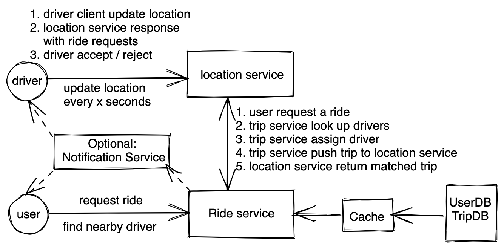

# 共享乘车服务 - 设计 Uber,Lyft...

## 题目
设计Uber

## 需求分析 
### 直接需求
* 用户可以实时上报所在位置
* 司机实时上报所在位置
* 用户可以查看附近的司机
* 用户发起乘车请求，配对附近的司机
* 司机接送用户之后不会再分配新订单，订单完成后可以重新分配

### 隐含需求
* 读写都频繁，写比读多
* 延时需要小
* 高可用性


## 估算 （Estimation）
* 同时在线用户：1M driver, 500K Passenger
* Write QPS: assume report location every 5 seonds, 1.5M / 5 = 300K
* Read QPS: 
    1. when user read neary by driver: 500K * 5 / 100K ~ 50 QPS
    2. when user view driver loc when during trip - can be combined with write
* Data storage: 
    1. 500M total user: 1KB * 500M = 500GB
    2. 1M daily trips: 1M * 365 * 5 * 1KB ~ 2TB

## 服务设计 (Service Design)



### 地理位置服务
这个服务是设计重点，在设计之前，我们需要先讨论怎么存储地理位置。
#### 选项一：QuadTree
树的每一个叶子节点代表一个地里位置，存有一个司机和乘客集合。

#### 选项二：GeoHash
`存储`：我们使用一个key-value存储即可
```
key: geoHash
value: Drivers<driver1, driver2 ....>

key: geoHash
value: Passengers<passenger1, passenger2 ....>

key: driverid, value: currentLocation(geohash, latlong, status)
key: passenderId, value: currentLocation(geohash, latlong, status)

```
为了提升查询速度，我们要把这些信息存在内存中。并且我们只需要存在线用户的信息，所以只需要1.5M * 1KB = 1.5GB 内存即可。

除了存geohash和司机/用户列表，我们也需要存用户和司机所在的位置，当用户和司机移动的时候，如果从一个geoHash对应的地方移动到另外一个geohash对应的地方，应当把用户和司机从老的geohash缓存里删除。


`优化`：为了快速满足用户的查询需求，我们同时还可以把数据存多份，比如`1a2b3c`这个位置的数据，可以同时存在`1a2b3`,`1a2b`,里面，这样存储空间需要增加2倍，变成24GB，依然不是很大。

`分区`：

#### 选择
无论是GeoHash还是QuadTree都是合理的，只要理解优缺点可以自圆其说即可。这里我们可以选择GeoHash，因为我们的系统是写频繁，需要避免QuadTree写操作的overhead。

### 匹配服务(ride service)


## 其他


