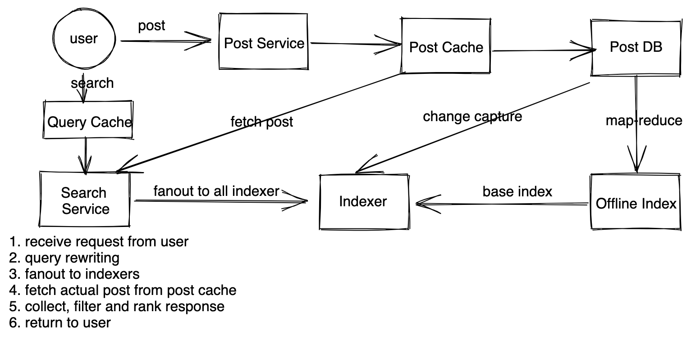

# 设计搜索系统 - Design Search System

常见题目有
* 设计facebook帖子搜索
* 设计twiter帖子搜索

## 需求分析

### 直接需求
* 用户可以发帖
* 用户发的帖子可以被别人搜索到
* （进阶）用户发的帖子有权限，只有朋友能搜索到（能看到帖子的人搜索到）

### 隐含需求
* 不需要强一致性，发完帖子不用马上搜索到
* 高可用性
* 读的延时要尽量小

## 估算
* DAU 1B, 20% will post 1 post a day, 60% user search a day
* Post size: 500 Bytes
* Write QPS: 1B * 0.2 / 86400 * 500 bytes ~ 200M/100k = 2k QPS
* Read QPS: 6k QPS
* Storage: 200M * 500Byte = 100GB
* Post in past 5 years: 100M * 365 * 5 ~ 365B. 
* Index Size: assume id size is 8 byes, 365B * 8 Bytes ~ 3TB 

写少读多，索引占用3T 空间，需要分布式服务。

## 服务设计

### 写服务
用户发帖，写服务写入缓存和帖子数据库。

### 在线索引服务（online index service）
收到用户发帖的信息，建立简单的倒排索引（inverted index）。索引服务监听数据库的变化，当有变化的时候，就索引。因为是在线服务，我们需要足够快，所以对帖子的处理比较简单，就做简单的分词，然后把词放入索引里面即可。索引可以看成是内存里面的哈希表`Map<Word, List<PostId>>`，也就是key-value缓存。前面计算了索引大小有3T，如果用128g 的机器，需要有24台。索引分区方式有两种。
`按照关键词分区`：如果按照关键词分区，好处是用户搜索一个词，只需要找到词对应的那个分区即可。坏处是关键词分布不均匀，很容易造成hot partition。数据增长不好预测，经常需要重新分区。
`按照帖子id分区`：好处是分布均匀，不会有hot partition，坏处是每个搜索请求需要发到所有的分区上，最后汇总。
我们选择按照帖子分区，原因是：
* 我们需要高可用性，希望系统容易维护不需要经常分区。
* 尽管每个搜索请求都要发到所有分区，请求可以同时发送，不会造成太多延时
* 6k QPS对于缓存来说不是很大的数字

### 离线索引服务（offline index service）
建立更复杂的倒排索引，可以有词条分析，语义分析，拼写改正的步骤，让索引更加全面，提升搜索准确度。离线服务可以定期（比如每天）跑一次，跑完了更新在线索引服务里面的索引。

### 搜索服务
搜索服务接受用户搜索请求，进行一定的query rewriting，比如拼写改正等等，然后把请求同时发送给所有的在线索引服务，在线索引服务返回结果以后，大致流程如下。
```
1. receive request from user
2. query rewriting
3. fanout to indexers
4. fetch actual post from post cache
5. collect, filter and rank response
6. return to user
```

### 帖子缓存
我们需要缓存一部分帖子，这样索引服务抓取帖子的时候能够更快。我们可以选择只缓存热门帖子，根据20-80理论，365B * 500Byte * 20% ~ 36TB，需要大约300台128g的机器。缓存也一样用帖子id作为分区，这样可以快速通过id找到帖子。

## Scale Up
#### 在线索引服务
在线索引服务每一台机器都需要承受很高的qps，同时我们需要保证高可用性，所以对这个服务我们需要有一些备份，这里我们选择2台备份机器，每个分区三台机器互相备份，因为我们对一致性要求不高，不需要leader-follower架构。

#### 缓存search query
我们还可以加search query 缓存，即存发送的搜索请求和他们的结果，这样连搜索都不需要执行，对于热门搜索，可以直接返回结果。但是考虑到实效性，对大小有一定限制，使用LRU策略淘汰，同时加一个比较短的ttl，比如一分钟或者五分钟，以防止信息太陈旧。

## 其他
#### 隐私设置
加入用户发的帖子只能让朋友搜索到怎么办？
```
假设用户a，b，c，a和b是好友，c不是。
a发两个帖子：{id:p1, word:apple, visibility: friends}, {id:p2, word:apple, visibility: all}
b使用apple搜索：返回p1,p2
c使用apple搜索：返回p2 
```
这里大致有几个思路。
`让搜索服务解决`：搜索服务从索引里拿到所有帖子的id，然后去帖子缓存里面得到所有的帖子，去好友关系数据库（或者缓存）里面获取用户和发帖人的关系，然后根据关系把帖子过滤掉。好处是索引简单，坏处是需要多一个好友关系缓存（但是其实社交网络都会存），并且在内存中过滤，可能会出现过滤完了没帖子返回的情况。
`在索引层面解决`：上面例子中的p1，我们在索引的时候加一个前缀，比如 b_apple:P1, apple:p2。当b搜索的时候，发两个请求，一个搜apple，一个搜b_apple。这样都都能拿到。好处是在索引级别就解决，不要复杂逻辑，坏处是索引会有很多重复词条，本来一个词，如果a有n个好友，就要变成n个词。

这里我们选择让搜索服务解决，因为比较好控制空间大小，为了处理过滤完了没帖子返回的情况，我们在去索引搜索的时候，需要多返回一些词条，从概率上减少问题出现的可能性。


https://medium.com/@morefree7/design-facebook-posts-search-10c9aceb6f39

https://dev.to/theinterviewsage/design-facebook-status-search-twitter-search-system-design-architecture-2bjk
