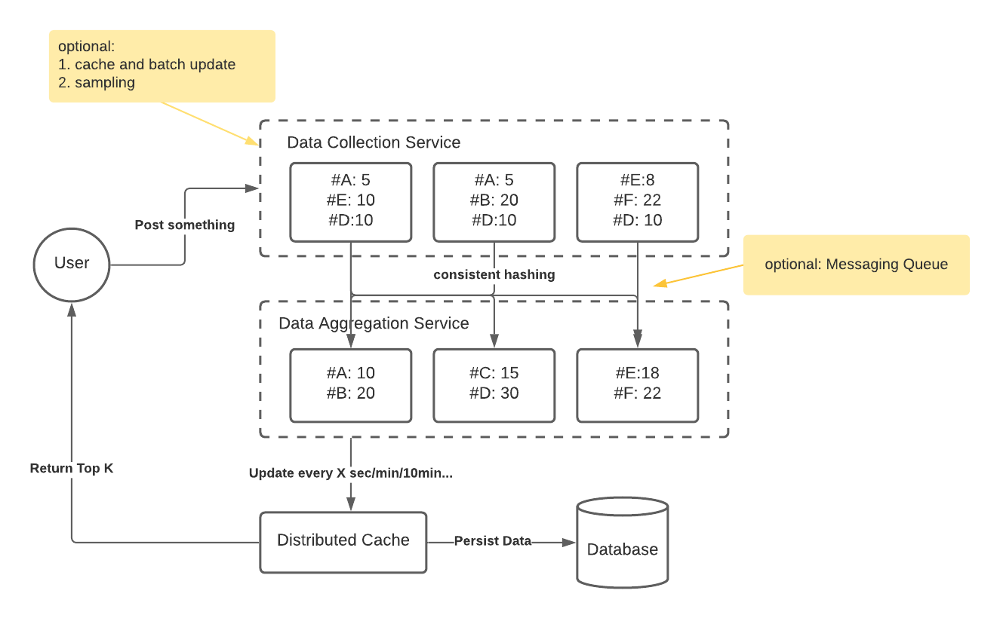

# Top K 问题 - Top K Problem

## 题目

这类型的题目大多都是设计一个类似排行榜的系统，通过对海量数据的聚合处理最后获得排名前K的东西，比如：

* 系统设计，一个music app，选出 top 10 songs。
* 实现前5分钟，1小时，24小时内分享最多的post的系统
* Design Twitter Trend, Determine trending topics
* 一个K recent contact 的service，就是当用户把鼠标点到chat对话框的时候，自动弹出K个最近的联系人。follow-up是如果要弹出K个最熟悉的人怎么设计，以及资源估计（需要多少台机器来做数据存储，多少个处理request等等）
* Desgin an Advertisement statistic system
* 一个大型系统中Top K个 Exception

## 总结
特点是写频繁，不用完全精确（精确程度需要和面试官确认）。由于是海量数据，推荐异步操作, 核心就是三个service
* 数据搜集（可以通过采样、缓存等方式优化） 
* 数据聚合（一致性哈希分配机器，桶，堆和队列进行统计）
* 数据查询（缓存等优化）

## 需求分析 
### 直接需求
为了行文方便，我们以社交网络用户用的最多的话题(hashtag) # 为例子。需求有
* 在大量分享中选出前k个热门话题
* 热门分享要根据时间分为10分钟，1小时，1天热门
* 用户每次发帖，带上话题(hashtag) # ，记录为一次

### 隐含需求
以下内容需要跟面试官确认。
* 写频繁 (write heavy)
* 数据不要求有非常高的实时性（可以有适当延迟）
* 数据不要求有非常高的精确性（只需要知道top k, 不需要知道具体分享的次数）
* 高可用性（一般系统都需要）
* 数据存储一致性 Consistency: 最终一致即可 Eventual consistency，CAP中更侧重A,P
* Top K 的 k有上限，比如100以内
* 10分钟，1小时，1天是从当前时间往前推算的，时间是一个固定数字

## 估算 （Estimation）
* DAU: 1 Billion, 20% of user post everyday  
* Write QPS: 1B * 20% / 86400 ~ 200M/100K ~ 2k QPS, peak QPS ~ 6k 
* Read QPS: 假设为写的10%， 200 QPS  
* Data storage: 假设 word (20 Bytes), count(8 Bytes) , 200M/day * 28 Bytes ~ 200*30MB ~ 6GB / day  

数据量虽然不大，但是QPS比较高，需要多台机器处理。

## 服务设计 (Service Design)
整体设计原理大致类似于Map-Reduce。我们先从最简单的情况开始计算，假如只需要单机处理少量数据，我们会把系统分为以下几个服务：

### 数据搜集（Data Collection）服务
每当用户发帖的时候，搜集帖子中的话题#，进行分析统计，类似于Map-Reduce中的 Map

### 数据聚合（Data Aggregation）、数据查询（Query）、存储(Data Storage) 服务
将搜集到的数据聚合统计，类似于Map-Reduce中的reduce。返回x时间段内的k个热门话题。从算法和数据结构的角度来说，为了返回k个热门话题，最简单的办法是去数据库查询时间范围内所有的记录，然后做一个排序，显然这样效率很低。通常为了返回top k，我们只需要在内存内维护一个小根堆（min heap）即可。当写频繁的时候，如果直接每次更新堆，频繁改动堆效率也十分低下。所以我们还需要通过其他数据结构作为辅助。这里我们可以选用队列(Queue)和哈希表(HashMap)。

我们用哈希表`Map<String, Long>` 存放每个话题出现的次数。同时我们将时间划分为多个桶(bucket)放入队列，桶的大小根据精度来确定，如果需要更高的精度，甚至可以以1秒为单位划分。假设我们不需要十分精确，当需要统计过去5分钟的数据，我们可以以30秒为单位，将5分钟划分为10个桶。需要一个小时，我们可以1分钟为单位划分，需要一天的数据，我们可以以半小时为单位划分。当某个话题# 被用户发出的时候，我们把该话题放入当前（队尾）30秒，当前分钟，当前30分钟所对应的桶里面。

当时间过去了30秒/1分钟/30分钟，我们将更早（队首）的桶移除队列，被移除的桶里面存有多个话题的出现次数，我们在Map中找到对应话题，减去相应次数。同时把队尾桶中的统计数据加入Map中。通过桶划分，我们把频繁的+1，-1操作变成了每隔一段时间 +x, -y，从而增加效率。同时我们保持一个大小为K的堆，当Map被更新以后，我们同时去堆里面寻找对应话题，如果堆里存在相应话题，则更新频率，如果不存在堆里，则和堆顶的元素比较，如果频率比堆顶元素的频率高，则替换堆顶元素。

查询的时候，只需要返回堆即可知道top k是什么。

## 服务扩容 （Scale Up)
### 多台机器处理 
当用户发帖量巨大的时候，假如我们用一台机器来统计数据，每次用户发帖都要记录到该机器上，机器负载过大，瓶颈是请求数量，而不是数据大小。此时数据聚合（Data Aggregation）服务需要多台机器进行统计。在划分（sharding）的时候我们需要特别注意划分方式，我们应该按照话题来划分，比如第1台机器只处理 #ABC 这个话题，所有的 #ABC 都应该分配到机器1来处理，每台机器都维持哈希表，桶队列和堆，最后我们把每台机器的top k合并再算出最终的top k。

如果不按照话题来划分，会导致某个局部不是top k，但全局是top k的话题无法被正确统计到。例如机器1 [#ABC: 2, #CDE: 3]，则Top1 是#CDE:3，机器2 [#ABC: 5, #FGH:5]则top1是 #FGH:5， 最后综合机器1，2，算出来的top1 是#FGH:5。 正确的Top1 应该是 #ABC:7。所以正确的划分方式是把ABC 都划分到机器1,[#ABC:2, #ABC:5], 所有的CDE, FGH都分到机器2 [#CDE: 3, #FGH:5] 这样我们就可以找出正确的top 1。 

为了保证每台机器的负载均衡和灾备，我们可以考虑使用一致性哈希（consitent hashing）作为划分算法。

### 减少网络流量（network traffic）、存储空间
如果发帖量多，每次在多台服务器之间发, 数据搜集和聚合服务之间的流量会变得很大，频发地发送+1，-1 十分占用网络资源，此时我们可以通过`缓存`，`消息队列`，`抽样`等方法来减少网络流量。具体使用哪种方法可以根据需求来讨论，也可以都使用。

#### 缓存
首先在数据搜集服务中进行一次缓存，考虑到我们只需要存话题和出现频率，占用存储空间很小，每台服务器都可以放一个in-memory cache专门来统计数据，每次用户发送带有话题 #ABC 的帖子，就更新缓存，搜集服务每隔2~5秒把数据发送给数据聚合服务。  
好处：成倍减少服务器间流量
坏处：根据发送频率不同，造成的大小不同的延时（一般几秒不是大问题）

#### 消息队列
在数据搜集服务和数据聚合服务之间增加个消息队列，数据搜集服务可以随时根据实际情况扩容，通过消息队列作为缓存，让数据聚合服务以某个固定的QPS从消息队列中读取。
好处：可以削峰，比如当某个话题突然变成热门的时候，流量突然突然变大，通过队列可以保证聚合服务不会突然承受大量请求。
坏处：流量突然变大，生产速度远远大于消费速度，导致缓存越来越多，延时会相应增加。

#### 抽样
考虑到每天用户发的帖子中，会有大量话题#只出现过一两次，而我们只需要知道Top K，k通常是一个比较小的数据，如果每个话题都存储，会存在长尾效应，我们存储量了大量没用的数据。因此我们可以对数据进行抽样，最简单的抽样办法就是给每个请求一个概率来判断要不要存储，比如0.1，就只有10%的请求会被继续处理，剩下的都丢弃，更复杂的抽样办法可以参考[海量数据处理](../SystemDesignBasics/massive-data-processing.md) 一文中介绍的方法。
好处：根据抽样方法不懂，可以数十倍或者数百倍减少流量。
坏处: 抽样导致精度丧失，如果需要统计准确的频率，不可使用抽样。

## 其他
#### 如果需求是用户每次登陆能看到最新热门话题
需要重新计算读写QPS。 当用户每次登陆都能看到的时候，问题就从写频繁变成读写都频繁。我们只需要增加一个分布式缓存服务即可，然后聚合服务每隔一段时间（2秒，1分钟，10分钟...) 发送(push)最近的top k到缓存即可。

#### 如果需要存储历史数据
我们只需要另外增加个服务，将缓存中的数据存储即可。数据库可以使用最简单的Key-value store. 

#### 系统架构
整个系统架构简化图

