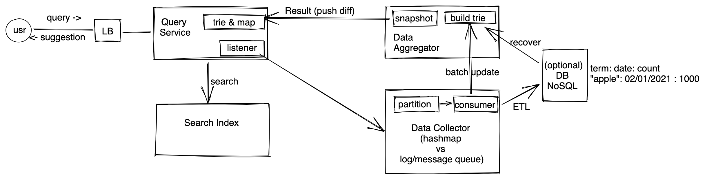

# 输入提示问题 - Typeahead Problem


## 题目
Typeahead/Auto Complete 一般用于输入提示/自动补全，这类问题在系统设计中也十分常见，一般typeahead有两种，一种是所有用户的typeahead提示都一样，是最近热门搜索词，另一种是根据用户自己的历史记录给出相应推荐，当然，有时候还会有混合型的。 这类问题在某些部分和[Top K 问题](top-k-problem.md) 相似，都是需要在大量数据中选出热门的搜索词条，对结果同样也不需要非常高的精度。不过Typeahead还有个读频繁的，在数据存储和分区方面会有不同

## 总结
读写都频繁，读比写多，不用完全精确选出提示内容（精确程度需要和面试官确认）。
* 数据查询（用户每次搜索通过查询服务返回提示）
* 数据搜集（可以通过采样、缓存等方式优化） 
* 数据聚合（一致性哈希分配机器，桶，堆和队列进行统计）


## 需求分析 
### 直接需求
* 用户输入的时候给出提示
* 提示的词条为5个（10个也行，一般为一个很小的数字），提示词条根据所有用户的搜索行为来选择，比如当前大量用户搜索apple，则输入app应该提示出apple。
* 不需要根据每个用户行为定制结果，即所有用户的提示都一样。
* 用户完成输入以后才显示结果（而不是根据用户输入不断展示结果 Google Instant Search）
* （进阶）让最新的热门词汇排在前面（比如 #a 今天被搜100次，昨天10次，#b昨天被搜200次，今天1次，尽管b搜索次数更过，我们还是要把#a排在前面）
* （进阶）需要做拼写检查，找出相近词的提示（比如color/colour， 或者recruiter/recrutier)


### 隐含需求
以下内容需要跟面试官确认。
* 读写频繁 (read & write heavy)
* 延迟要低，不能等用户都输入完成了才显示之前的提示
* 数据不要求有非常高的实时性（可以有适当延迟，比如几分钟，但不能是一天或者几个小时）
* 数据不要求有非常高的精确性（只需要知道热搜前几名是什么即可）
* 高可用性（一般系统都需要）

## 估算 （Estimation）
* DAU: 1 Billion, 每个用户每天搜索一次，平均词长度为5 <br>
* Write QPS: 1B  / 86400 ~ 1B/100K ~ 10k QPS, peak QPS ~ 30k<br>
* Read QPS: Write的5倍，150k <br>
* Data storage: 后面会讨论 <br>

数据量大，服务用户多，肯定需要分布式系统来处理。

## 服务设计/数据流
整个系统可以分为两大部分，一部分是写服务，主要接受用户查询请求，并做出统计。另一部分是读服务，根据用户输入，每次给用户提示。如果只有单台机器，我们可以在机器中划分出以下几个服务。



### 搜索服务（Query/search service)
读请求的核心在搜索服务，主要功能有：
* 采集用户输入词汇，根据用户输入返回特定搜索结果.
* 在用户输入词汇的时候，在用户完成输入之前，给用户提示。


#### 数据结构
搜索服务需要在内存里面维持一个数据结构，当用户输入的时候，直接从该结构里面快速获取提示。数据结构有两个选项：

##### 选项一
使用经典的Trie，每个节点存该节点对应前缀的提示。
```
root - a {"apple":10, "animal": 9...}
       |_ p {"apple":10, "apac": 8...}
       |  |_ P {"apple":10, "app": 7...}
       |
       |_ c  {"account":15, "acid": 8...}
       ....   
```
选Trie 一个比较大的优势是节省空间，比如对于 a, ap, app, 我们只需要存 a,p,p三个节点即可，每次搜索的时候，时间复杂度为o(l), l为用户输入的前缀长度。

##### 选项二
直接使用哈希表存每个单词和它对应的提示。
```
["a": {"apple":10, "animal": 9...}]
["ap": {"apple":10, "apac": 8...}]
...
```
和Trie相比，哈希表会需要更多的空间，因为a，ap，app要分开存储，优点是查询的时候复杂度只有o(1)。

##### 选择
在系统设计中，两个选项都是可以接受的，只要给出合理解释即可。但是在本文中我们选择混合模式，即保持一个trie存，同时维护一个哈希表存高频查找的词，这样两者优势都可以兼顾。
* 我们要优化latency，可以牺牲一定的空间实现o(1)复杂度。
* 假设有1 billion前缀，每个前缀存10个提示，前缀平均长度为5，提示平均长度为15，如果存在哈希表里面则我们需要 (15Bytes * 10 + 5 Bytes) * 10^9 ~ 155GB，并不是很大的数字。

#### 数据格式
##### 选项一：直接存储被搜索次数
譬如 ["apple":100, "applicaion":120,....]
每次被搜索就把统计次数+1，这样统计的缺点在于，最新的热搜权重不够，比如 #a 今天被搜100次，昨天10次，#b昨天被搜200次，今天1次，尽管b搜索次数更过，我们还是要把#a排在前面。

##### 选项二：使用加权移动平均（exponential moving average)
我们使用EMA给最近的热搜更高的权重。 比如我们要统计10天EMA。
```
10日EMA的算式为：（分母=10+1）
EMA（10）= 前一日EMA(10) * 9/11＋今日搜索次数×2/11
```
我们在系统中维持每个词的前一日EMA，同时统计今天被搜索的次数，这样就可以算出今天的EMA。

##### 选择
我们先选择使用选项一，单纯统计被搜索次数，之后再讨论加权移动平均。


### 数据搜集（Data Collector）服务
监听搜索服务的输入，每当用户完成输入的时候，搜索服务会通过异步的方式将用户的输入发给搜集服务，搜集服务进行分析统计，


#### 更新机制
##### 选项一：实时更新
我们在内存中维持一个哈希表，key是被搜索的词，value是被搜索的次数，每次一个词被搜索，我们就把次数加一。这样的问题是，如果某一个词被频繁搜索，存那个词的机器会成为hot partition，每次+1都要对那条记录上锁，效率也不高，当然我们可以给每个请求都分配一个随机id，用这个id来做分区，让多台机器同时统计同一个词的次数，然后再有个类似reducer的服务定期从这些机器中抓取数据，最后组合成完整的数据。

##### 选项二：批量更新（离线）
我们在硬盘上维持一个log文件，把每一次搜索当成一条记录加到该log文件的末尾。然后通过Map-Reduce的方式最后统计出每个词被搜索了多少次。定期运行map-reduce即可。

##### 选项三：批量更新（在线）
如果对Message Queue比较熟悉的话，会发现其实维持一个log，就是经典的log-based message queue。所以我们的数据搜集服务完全可以只用一个log-based message queue（比如kafka），然后reducer就是queue的消费者（consumer），直接从log里面抓数据即可。consumer可以先缓存一些数据，比如把log里面的 +1,+1,+1... 变成 +10，每个词被搜索10次了才把增量发送给聚合服务。 

##### 选择
选项一直接在内存，虽然一个词的搜索次数可能存在多台机器上，但是依然可以很快读到所有需要的数据，缺点是内存中的数据会丢失。选项二不需要很大的内存，写操作非常快，不容易丢失数据。同样三个选项都可以，这里我们选择选项三：在线批量更新。比实时更新更少overhead，比离线批量更新更有实效性，同时message queue还能做流量削峰，防止突然增加流量。


### 数据聚合（Data Aggregation）服务
数据搜集服务把数据整理好了以后，会提供一个所有词的搜索次数，或者所有词的移动加权平均（score），根据这个结果，我们需要另外一个服务把这个结果转化成搜索服务里的结果（trie）。聚合服务内存里维持一个trie，和哈希表，哈希表统计所有词出现的次数，每当某个词次数被更新的时候，就去和trie里面的词做比较，如果出现次数超过了trie里面已有的词，那么就把trie里面的替换掉，这个trie是一直在动态更新的。为了节省空间，这个trie每个节点可以只存提示的reference，这样trie可以占用更小空间。聚合服务定期（比如每个小时）生成一个当前trie的快照（snapshot），把这个快照发给搜索服务，为了减少数据传输量，可以直接传diff。 搜索服务里面的trie是只读的，这样避免同时在一个树上读写操作影响效率。


### 数据存储
最终我们需要一个简单的表格，存每个搜索词的被搜索次数，如果需要颗粒度更高的数据，我们可以按照每个词每天被搜索多少次来存，这样就可以算加权平均，数据搜集服务可以定期把数据etl到数据库里。存储不是必要的，每次需要数据完全可以直接运行一个Map-Reduce直接计算数据。如果选择存储，因为我们会有比较多的写操作，并且数据之间没有很强的联系，也不需要ACID操作，所以如果一定要存储，可以直接选一个NoSQL，方便对写操作扩容。


## Scale up
#### Query Service怎么scale up
trie和哈希表占用的内存100G-200G，尽管高性能服务器内存能装得下，但是前面提到Read QPS 非常高有150k，所以我们还是要做分区。然后由load balancer来分配用户请求，分配算法就是简单的一致性哈希即可。

##### trie partition
根据路径来做分区，千万不要把a开头的都分到一个去，把b开头的都分到一个区，这样很容易造成hot partition。应该根据完整的路径来分区，比如 a--> host1, ab --> host2, abb --> host3，这样可以均衡负载。分区算法参照一致性哈希。
##### cache
上面提到，我们同时维持一个trie和哈希表，哈希表里存热门词的提示，实际上这就是缓存，分区方式和trie一样，这样一个词能分到同一个trie所在的分区。
##### 备份
每个分区都可以有一两个replica，当分区故障的时候就可以，load balancer可以自动分配。

#### Data Collector 搜集服务怎么scale up
我们在前面提到我们用message queue，可以轻松处理百万级别的吞吐，我们同样可以根据被搜索的词来对message做分区，分区算法依然是哈希。搜集服务

#### 瞬间有大量搜索
Message queue可以做到流量削峰。同时可以做一些取样减少统计频率。

#### Data Aggregator 聚合服务怎么scale up
前面提到，搜集服务可以先缓存一些数据，然后累计到一定数量之后再发批量给聚合服务，这样已经减少了聚合服务的压力，但是聚合服务依然需要在内存中建立trie，而且聚合服务中的trie 节点需要存更多内容，所以聚合服务也一样要分区，分区方式和搜索服务一样，通过每个词的哈希来分区即可，备份也相同。
##### 备份
聚合服务可以每隔一段时间把trie写入硬盘持久化，如果出现故障，恢复以后可以直接把硬盘里存的trie再加载出来，如果有database，也可以直接从database里面加载数据。

#### 处理长尾效应
在搜索服务就可以做sampling，通过sampling去掉出现比较少的词，比如每100个搜索抽样一个拿来统计。这样可以减少

#### log太多了怎么办
定期ETL数据到DB，清理log。使用抽样，不必每次都+1。

## 其他

#### 每个用户看到结果不一样
搜索服务不变，但是在返回之前可以再去抓用户过去搜索记录等等数据，然后把结果混合返回给用户。

#### 客户端缓存    
我们可以在用户端缓存一些热门词的提示，或者根据用户搜索历史缓存一些。

#### 过滤敏感词
因为我们更新trie是异步，如果我们在写的时候过滤敏感词，那么需要一定时间才会反映到搜索服务里面，所以最快的方式是直接在搜索服务里加个denylist，返回结果的时候做个快速的filter，同时也不再继续写入。 搜集和聚合服务也一样可以在相同的黑名单。


## 参考资料
* [Facebook Typeahead Search Tech Talk (6/15/2010)](https://www.facebook.com/Engineering/videos/432864835468)