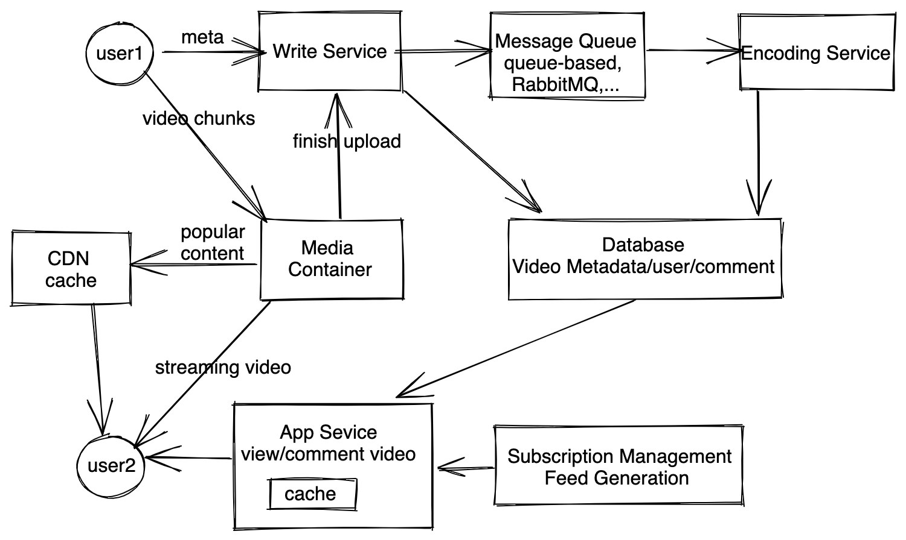

# 设计视频网站/流媒体平台 

这类型的题目大多都是设计一个流媒体服务
* 设计音乐网站比如spotify
* 设计youtube/netflix...

## 需求分析 
### 直接需求
* 用户可以上传发布视频，提供标题，内容等
* 用户可以搜索视频，浏览视频的时候有缩略图，看别人视频
* 用户可订阅频道
* 用户可以评论
* （进阶）多设备管理，同一个用户只能在一个设备上播放同一个视频
* （其他）推荐功能

### 隐含需求
* 读多写少，但写请求比较大
* 高可靠性，用户发送的内容不能丢了
* 不需要强一致性，但也不能有太多延迟
* 高可用性（一般系统都需要）
* 流媒体存储需要大量硬盘空间，视频传播需要带宽


## 估算 
* DAU: 500M  <br>
* Write QPS: 假设1%用户发视频，500M % 1% / 86400 ~ 50M/100k ~ 500 QPS, peek 1k<br>
* Read QPS: 假设用户看5个视频，500M * 5 / 86400 ~ 2500M/100K = 25K QPS <br>
* Data storage: 假设每个视频100MB, 100MB * 5M ~ 500TB / day <br>

数据量大，占用大量带宽，服务用户多，肯定需要分布式系统来处理。

## 服务设计/数据流
服务可以分成以下部分。


### 写服务（视频上传）
写服务允许用户上传视频，并且提供视频标题，描述等内容。当用户要上传的时候，客户端和文件上传服务（media continer)通信，上传服务返回给客户端一个视频uuid，然后用户编辑标题，描述等内容的时候可以附上uuid，一并发给上传服务（write service）。这里刻意把上传视频和上传元数据分开，是为了减轻写服务的压力，上传视频到专门的服务器，可以做针对性的优化。上传的过程可以把视频分为不同的chunk上传，这样支持断点续传。

视频元数据存储，因为视频数据读多写少，SQL和NoSQL都可以选择使用。使用SQL的好处是很容易建立索引实现查找用户的视频等功能，并且SQL可以通过leader-follower来scale up。如果我们使用NoSQL存储，那么需要另外denormalized数据，找到某个用户发的所有视频。这里我们选择SQL。

### 视频转码服务（encoding service）
用户上传的视频需要做转码处理，生成缩略图（thumbnail），转成不同的格式，清晰度等等，这一部分内容显然应该通过异步操作完整，这样在后台执行不会影响用户体验。在视频完成上传之后，应该把视频放入一个处理队列（message queue），然后消息队列的消费者是转码服务。消息队列应该选择queue-based的，而不是log-based的。因为每个视频处理时间不同，而且不我们不需要维持一个log，queue-based消息队列可以根据消费者的情况分配任务，log-based的不行， 如果一个任务要处理很久，那么剩下的任务就需要等。

### 读服务（搜索，观看）
用户获取视频有两个渠道，一个是通过搜索找到视频，搜索不是本题的重点，所以可以假设有一个搜索服务即可。另一个是通过订阅服务观看订阅的内容。我们可以根据用户订阅生成相应的feed。这一部分和设计Newsfeed 十分类似，在此不详细展开。

读服务需要返回给用户一堆视频数据，并不返回视频本身，因为用户不一定都会播放，视频数据包含文字信息，缩略图的uuid和视频的uuid，对于缩略图，可以去media container里面拿，同样是为了减少延时。这样用户界面可以至少先显示文字内容，然后等图片加载完了再渲染。

当用户选择播放视屏的时候，直接把视频uuid发给media container，然后media container就可以给用户播放流媒体。

## Scale up
#### 视频元数据怎么分区
`按照用户uuid分`：所有用户的视频都分在一个分区，这样的好处是一台机器上就能找到一个用户所有的视频，但是问题是某些用户会成为热门用户，用户发布的视频不均衡而且不好预测，经常要re-partition数据库。
`按照视频uuid分`：好处是能均匀分布，坏处是查找用户视频的时候需要去多台机器访问。但是这个我们可以在内存中使用缓存解决。所以我们应该选择按照uuid来分。

#### 缓存和CDN
我们需要几个数据缓存来提升性能。
```
map<user_id, Lis<Video>> 用户和其发布的视频
map<user_id, List<Feed>> 用户和其主页的feed
map<video_id, videoMetadata> 视屏id和视频对应的数据（标题，内容，缩略图uuid）
map<video_id, List<Comments>> 视频id和视屏对应的评论
```
这些缓存可以直接放在读服务对应的服务器上。

除了数据缓存，还有多媒体也需要缓存，视频/缩略图都可以放在CDN上，CDN在不同的地理位置都有节点，这样用户访问多媒体的时候，可以选择就近的节点传输数据，提高速度。

#### ISP 缓存
如果用户量足够大，我们甚至可以把缓存放到ISP的服务上，这样比去CDN更快。而且还能减少对带宽的占用。


#### 某个视频十分热门怎么办
即使有缓存，某个视频变得特别热门，同时多人在线看，还是可能，所以我们对缓存里面的文件也要做备份，有多台机器存热门视频，当一台机器无法承受流量的时候，返回redirect让客户端定向到另外一个服务器上。可以参考一致性哈希的备份方式。

## 其他

#### 评论服务
用户可以评论视频，也可以看视频评论。评论可以存在SQL 也可以存在NoSQL，评论分区方式有两种，一是根据视频id来分区，二是根据评论本身的id来分区。根据视频来分区的好处是一个视频的评论都在一起可以很快加载，坏处是数据分布不均匀，会导致数据库负载不均衡，所以我们应该根据评论本身uuid来分区，同时维持一个缓存，denormalize评论。基本和其他模块类似。 

#### 用户可以多台设备登陆，同一个用户只能在一个设备上播放同一个视频
维持用户session，每台设备上的session_id不同，我们在内存中维护一个列表，保存用户每个session正在播放的视频，这个缓存需要使用用户uuid来做哈希，这样可以保证所有设备都访问同一个主机的缓存，不会有consistency issue，并且每个用户播放行为不会导致hot partition。每次用户播放新的视频的时候，检查缓存即可。

#### 网络不好的地方怎么处理
客户端在加载视频之前先ping以下服务器测量网络状况，然后服务器根据相应的结果自动选择低清晰度的视频返回。

#### 视频去重
如果很多用户上传相同视频，或者某个用户上传的视频是另外一个视频的片段，我们不希望重复存储，对此，我们可以把视频分为不同的chunk，当用户上传某一个chunk的时候，我们对该chunk做一个checksum(chunk)，如果文件系统中已经存在相同checksum的chunk我们就不上传那个chunnk了。具体可以参照分布式文件系统的设计。

#### 推荐功能
参考top-k设计。